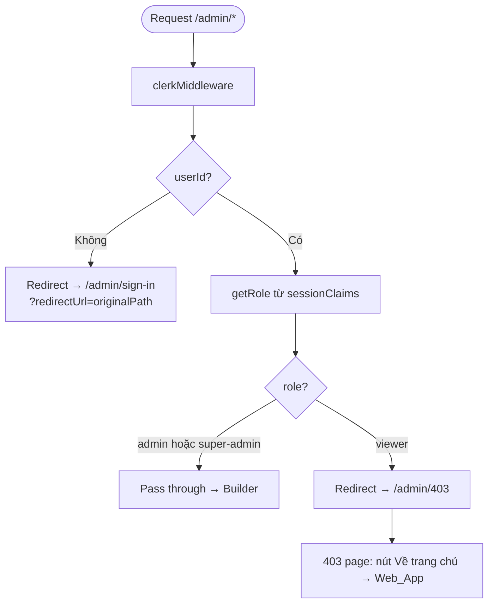
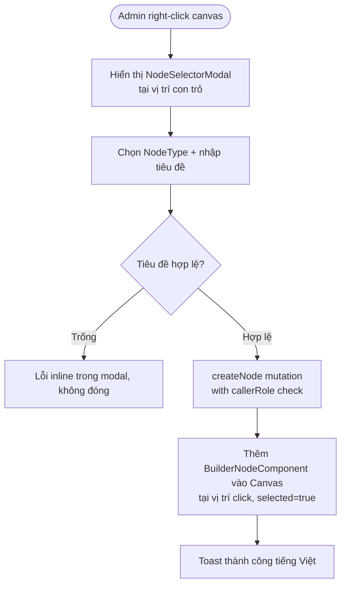
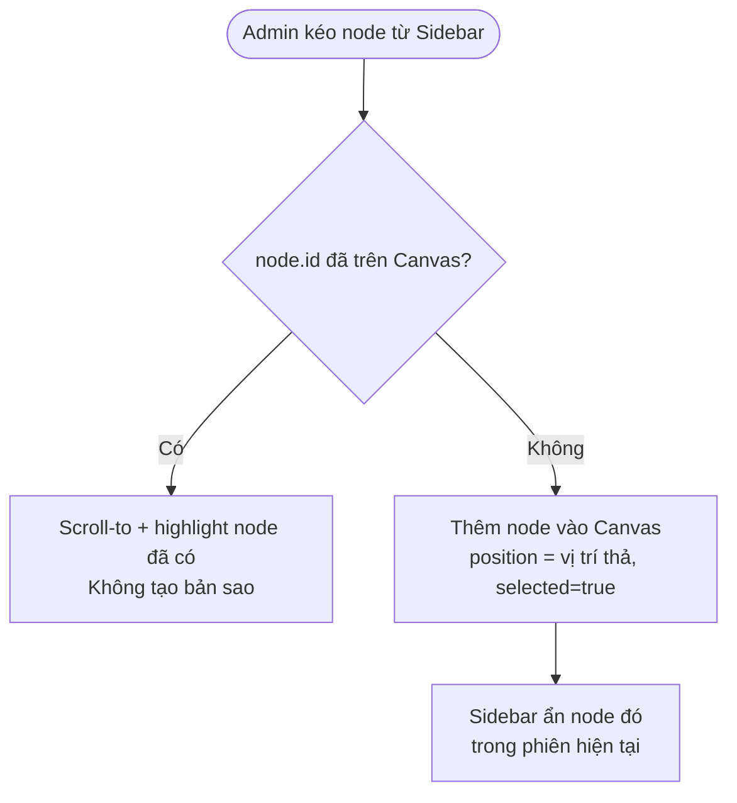
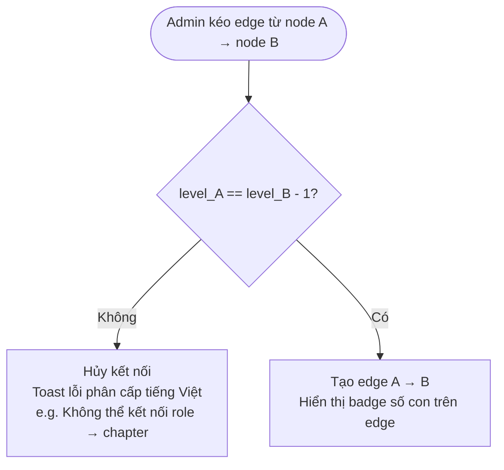
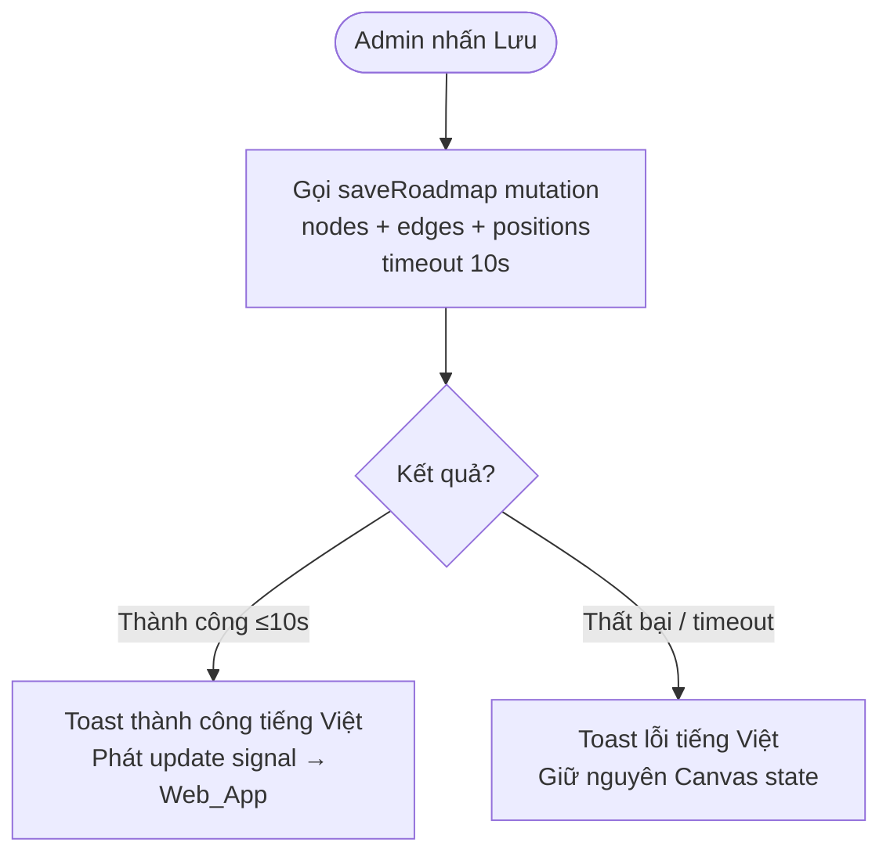
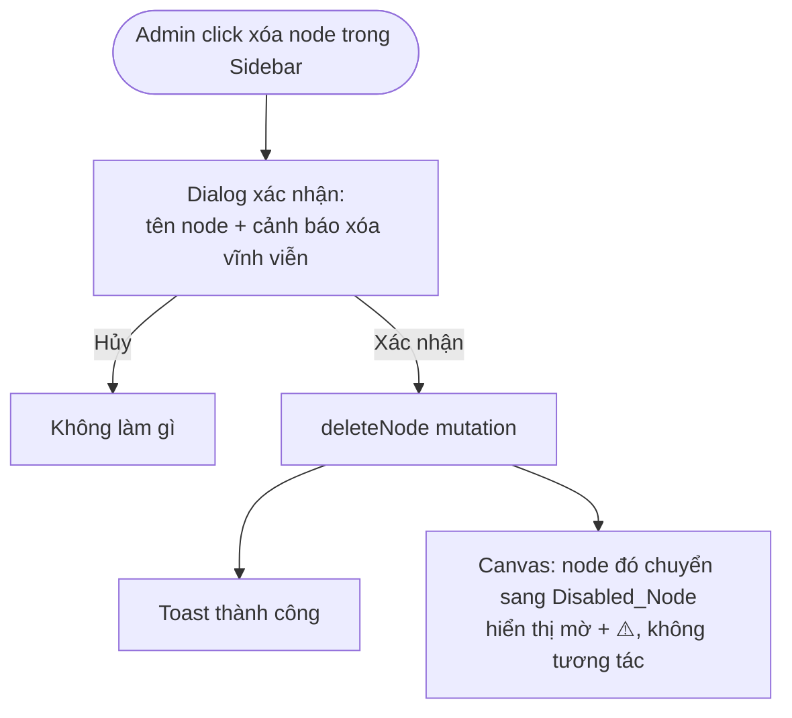
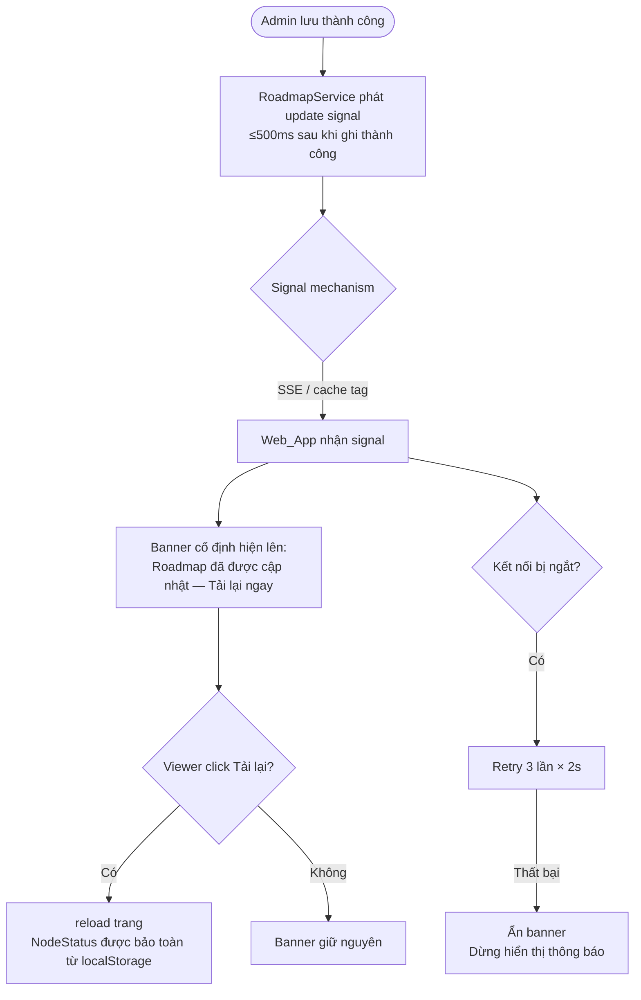

# Design Document: Roadmap Builder Admin

## Overview

Roadmap Builder Admin là tính năng cho phép admin và super-admin xây dựng và quản lý roadmap trực tiếp trên canvas ReactFlow trong `apps/admin`. Thiết kế này **mở rộng** domain logic hiện có tại `packages/core/src/roadmap` (submodule `IDISAI/roadmap`) và thêm các route CRUD vào `apps/admin`, hoàn toàn không làm thay đổi hành vi hiện tại của `apps/web`.

### Nguyên tắc thiết kế

- **Submodule-first**: Mọi domain logic (types, service, hooks) đều commit vào submodule `packages/core/src/roadmap` trước, sau đó app dùng.
- **Mock → GraphQL ponytail**: Các phương thức mới vẫn dùng mock trong giai đoạn đầu; khi backend `svc-roadmap` sẵn sàng, chỉ cần swap body mà không đổi caller.
- **ReactFlow editable layer**: Reuse `InteractiveRoadmap` pattern; tạo `BuilderCanvas` riêng với `nodesDraggable={true}` và onConnect/validation logic.
- **Clerk-gated routes**: Dùng cùng pattern `getRole()` / `clerkMiddleware` hiện có.


---

## Architecture

### Tổng quan luồng dữ liệu

```
apps/admin (port 3002, basePath=/admin in prod)
  ├── middleware.ts         ← Clerk gate: admin | super-admin only
  └── app/
      ├── roadmaps/         ← list + create roadmap
      ├── roadmaps/[id]/    ← builder canvas (NEW)
      └── 403/              ← forbidden page (NEW)
          │
          ▼ imports
packages/core/src/roadmap/   (submodule IDISAI/roadmap)
  ├── types.ts              ← extended: NodeType, articleType, slug
  ├── roadmap.service.ts    ← extended: createRoadmap, updateRoadmap, deleteRoadmap,
  │                             createNode, updateNode, deleteNode (callerRole checked)
  ├── graphql/              ← NEW sub-feature: codegen types
  └── builder/              ← NEW sub-feature: admin-only components & hooks
      ├── types.ts
      ├── index.ts
      ├── components/
      │   ├── BuilderCanvas.tsx
      │   ├── BuilderNodeComponent.tsx
      │   ├── NodeSelectorModal.tsx
      │   ├── NodeDetailDialog.tsx
      │   ├── NodeEditPanel.tsx
      │   ├── NodeSidebar.tsx
      │   ├── HoverPreview.tsx
      │   └── GraphPreview.tsx
      └── hooks/
          ├── use-builder-canvas.ts
          ├── use-node-sidebar.ts
          ├── use-hover-preview.ts
          └── use-save-roadmap.ts
```


---

## Phân cấp Component React

```
app/roadmaps/[slug]/builder/page.tsx        [Server Component — RBAC gate]
└── BuilderPageClient.tsx                   [Client Component — provider setup]
    ├── ApolloProvider
    ├── BuilderCanvas.tsx                   [ReactFlow canvas chính]
    │   ├── RoadmapFlowNode (custom node)  [BuilderNode.tsx]
    │   │   ├── Handle (source/target)
    │   │   └── NodeTypeBadge
    │   ├── EdgeWithChildCount             [custom edge với badge]
    │   ├── NodeSelectorModal.tsx          [xuất hiện khi right-click]
    │   │   ├── NodeTypeButton × 4        [role / skill / chapter / article]
    │   │   └── TitleInput
    │   ├── HoverPreview.tsx               [tooltip 300ms delay]
    │   │   ├── NodeInfoCard
    │   │   └── GraphPreviewMinimap.tsx    [ReactFlow read-only 320×240]
    │   └── NodeDetailDialog.tsx           [shadcn Dialog — double-click]
    │       ├── NodeInfoSection
    │       ├── NodeEditPanel.tsx          [form chỉnh sửa metadata]
    │       │   ├── TitleField
    │       │   ├── DescriptionField
    │       │   ├── NodeTypeBadge          [read-only]
    │       │   └── ArticleFields          [chỉ hiện với NodeType=article]
    │       └── DialogActions [Chỉnh sửa | Xóa | Điều hướng]
    └── BuilderSidebar.tsx                 [shadcn Sheet — panel bên phải]
        ├── SearchInput                    [debounce 300ms]
        ├── NodeTypeGroup × 4              [role / skill / chapter / article]
        │   └── DraggableSidebarNode × N
        └── DeleteConfirmDialog
```

---

## Quản lý State

### useBuilderState (Zustand store)

```typescript
interface BuilderState {
  // ReactFlow state
  nodes: BuilderNode[]         // RoadmapFlowNode[] mở rộng
  edges: Edge[]
  selectedNodeId: string | null

  // UI state
  contextMenu: { x: number; y: number; canvasPosition: XYPosition } | null
  hoveredNodeId: string | null
  hoverTimer: ReturnType<typeof setTimeout> | null

  // Save state
  isDirty: boolean             // có thay đổi chưa lưu
  isSaving: boolean
  lastSavedAt: Date | null

  // Actions
  addNode: (node: BuilderNode) => void
  updateNodeData: (id: string, data: Partial<RoadmapNode>) => void
  removeNode: (id: string) => void
  setNodes: (nodes: BuilderNode[]) => void
  setEdges: (edges: Edge[]) => void
  openContextMenu: (pos: ...) => void
  closeContextMenu: () => void
  setHovered: (id: string | null) => void
  markSaved: () => void
}
```

### Optimistic Update Pattern

```
1. Lưu snapshot: previousState = currentNode
2. Cập nhật local store ngay lập tức (UI phản hồi < 100ms)
3. Gọi GraphQL mutation bất đồng bộ
4a. Thành công → xóa snapshot, hiển thị toast "Đã lưu"
4b. Thất bại → restore previousState, hiển thị toast lỗi tiếng Việt
```


### Multi-Zone Integration

`apps/admin` là child zone, được proxy bởi `apps/web` qua `rewrites()`. Không thay đổi cấu hình này. Builder routes chỉ sống trong `apps/admin`:

```
GET /admin/roadmaps          → apps/admin/app/roadmaps/page.tsx
GET /admin/roadmaps/[id]     → apps/admin/app/roadmaps/[id]/page.tsx
GET /admin/403               → apps/admin/app/403/page.tsx
```

---

## UI/UX Wireframes

### Screen 1: `/admin/roadmaps` — Danh sách roadmap

```
┌─────────────────────────────────────────────────────────────────────┐
│  LOGO  [Web] [Admin ←active]               [☀/☾]  [User ▼]        │
├─────────────────────────────────────────────────────────────────────┤
│  Quản lý Roadmap                           [+ Tạo roadmap mới]     │
├─────────────────────────────────────────────────────────────────────┤
│  ┌─────────────────────────────────────────────────────────────┐   │
│  │ Tên           │ Slug         │ Nodes │ Published │ Hành động │   │
│  ├─────────────────────────────────────────────────────────────┤   │
│  │ Frontend Dev  │ frontend     │ 24    │ ✓         │ [Sửa][Xóa]│  │
│  │ Backend Dev   │ backend      │ 18    │ ✓         │ [Sửa][Xóa]│  │
│  │ DevOps        │ devops       │ 12    │ ✗         │ [Sửa][Xóa]│  │
│  └─────────────────────────────────────────────────────────────┘   │
└─────────────────────────────────────────────────────────────────────┘
```


### Screen 2: `/admin/roadmaps/[id]` — Builder Canvas

```
┌─────────────────────────────────────────────────────────────────────┐
│  LOGO  [Web] [Admin ←active]               [☀/☾]  [User ▼]        │
├─────────────────────────────────────────────────────────────────────┤
│  ← Roadmaps / Frontend Developer        [Lưu]  [Xóa roadmap]      │
├────────────────────────────────────────┬────────────────────────────┤
│  CANVAS (ReactFlow, editable)          │  NODE SIDEBAR              │
│                                        │  ──────────────────────── │
│  [right-click → NodeSelectorModal]     │  🔍 [Tìm kiếm node...]    │
│                                        │  ──────────────────────── │
│  ┌──────────────────────┐             │  ROLE (🟣)                 │
│  │  ● Frontend Engineer │  role       │    ○ Frontend Engineer      │
│  │  [drag handles]      │             │    ○ Backend Engineer       │
│  └──────────┬───────────┘             │  ──────────────────────── │
│             │ [badge: 2]              │  SKILL (🔵)                 │
│  ┌──────────┴───────────┐             │    ○ HTML & CSS             │
│  │  ● HTML & CSS        │  skill      │    ○ JavaScript             │
│  └──────────┬───────────┘             │  ──────────────────────── │
│             │ [badge: 3]              │  CHAPTER (🟢)               │
│  ┌──────────┴───────────┐             │    ○ Intro to HTML          │
│  │  ● Intro to HTML     │  chapter    │  ──────────────────────── │
│  └──────────────────────┘             │  ARTICLE (🟡)               │
│                                        │    ○ HTML Basics (notion)   │
│  [drag nền = pan]                      │    ○ CSS Grid (jupyter)     │
│  [Ctrl+scroll = zoom]                  │                            │
└────────────────────────────────────────┴────────────────────────────┘
```


---

## Sơ đồ UI/UX ASCII

### 1. Builder Page — Bố cục tổng thể

```
┌─────────────────────────────────────────────────────────────────────────────────┐
│  HEADER  [PlatformSwitch: Admin ↕ Web]              [ThemeToggle] [UserButton]  │
├─────────────────────────────────────────────────────────────────────────────────┤
│  TOOLBAR                                                                        │
│  ┌──────────────────────────────────────────────────────────┐ ┌──────────────┐ │
│  │ ← Danh sách Roadmap  │  "Roadmap: Lập trình Web"         │ │ [💾 Lưu]    │ │
│  │                      │  ○ chưa xuất bản                  │ │ [🗑 Xóa]   │ │
│  └──────────────────────────────────────────────────────────┘ └──────────────┘ │
├────────────────────────────────────────────────────┬────────────────────────────┤
│                                                    │  SIDEBAR (shadcn Sheet)    │
│   CANVAS (ReactFlow)                               │                            │
│                                                    │  🔍 [Tìm kiếm node...  ] │
│   ·  ·  ·  ·  ·  ·  ·  ·  ·  ·  ·  ·  ·          │                            │
│   ·                                    ·          │  ── ROLE ──────────────── │
│   ·   ┌──────────────────┐             ·          │  ⬡ Frontend Developer     │
│   ·   │ ⬡ Frontend Dev   │             ·          │  ⬡ Backend Engineer       │
│   ·   │ [role]           │             ·          │                            │
│   ·   └────────┬─────────┘             ·          │  ── SKILL ─────────────── │
│   ·            │ ●3                    ·          │  ◈ ReactJS                │
│   ·   ┌────────┴────────┐              ·          │  ◈ Node.js                │
│   ·   │ ◈ ReactJS       │             ·          │  ◈ TypeScript             │
│   ·   │ [skill]         │             ·          │                            │
│   ·   └────────┬────────┘             ·          │  ── CHAPTER ───────────── │
│   ·            │ ●2                   ·          │  ▣ Hooks & State          │
│   ·   ┌────────┴───────┐              ·          │  ▣ Performance            │
│   ·   │ ▣ Hooks        │             ·          │                            │
│   ·   │ [chapter]      │             ·          │  ── ARTICLE ───────────── │
│   ·   └────────────────┘             ·          │  ▷ useEffect Deep Dive    │
│   ·  ·  ·  ·  ·  ·  ·  ·  ·  ·  ·  ·  ·          │  ▷ React Query Guide      │
│                                                    │                            │
│   [+] [−] [⊞] [↻]  Controls                      │  [+ Thêm node mới]        │
└────────────────────────────────────────────────────┴────────────────────────────┘
```

*Ghi chú biểu tượng: ⬡=role (xanh dương), ◈=skill (tím), ▣=chapter (cam), ▷=article (xanh lá)*
*Badge ●N trên edge = số lượng node con trực tiếp của node đích*

---

### 2. NodeSelector_Modal (Right-click trên Canvas)

```
Vị trí: xuất hiện ngay tại điểm click chuột phải

          ┌──────────────────────────────────────┐
          │  Tạo node mới                    [✕] │
          ├──────────────────────────────────────┤
          │  Tiêu đề node                        │
          │  ┌────────────────────────────────┐  │
          │  │ Nhập tiêu đề...                │  │
          │  └────────────────────────────────┘  │
          │  ⚠ Tiêu đề không được để trống        │  ← hiện khi submit trống
          │                                      │
          │  Chọn loại node:                     │
          │                                      │
          │  ┌──────────┐  ┌──────────┐          │
          │  │  ⬡ ROLE  │  │◈ SKILL  │          │
          │  │ (cấp 1)  │  │ (cấp 2) │          │
          │  └──────────┘  └──────────┘          │
          │  ┌──────────┐  ┌──────────┐          │
          │  │▣ CHAPTER │  │▷ARTICLE │          │
          │  │ (cấp 3)  │  │ (cấp 4) │          │
          │  └──────────┘  └──────────┘          │
          │                                      │
          │              [Hủy]  [Tạo node →]    │
          └──────────────────────────────────────┘

Khi tạo node con từ node cha (cha là "skill"):
          - Chỉ button [▣ CHAPTER] được kích hoạt
          - Các button còn lại mờ (disabled) với tooltip giải thích cấp
```


### Screen 3: NodeSelectorModal (right-click context menu)

```
┌──────────────────────────────────┐
│ Tạo node mới                     │
├──────────────────────────────────┤
│ Loại node:                       │
│  ○ Role    ○ Skill               │
│  ○ Chapter ○ Article             │
├──────────────────────────────────┤
│ Tiêu đề *                        │
│ ┌────────────────────────────┐   │
│ │                            │   │
│ └────────────────────────────┘   │
│  [tối đa 150 ký tự]              │
│  ← lỗi inline nếu trống          │
├──────────────────────────────────┤
│         [Hủy]  [Tạo node]        │
└──────────────────────────────────┘
```

### Screen 4: NodeDetailDialog (double-click node)

```
┌──────────────────────────────────┐
│ HTML & CSS              [skill]  │  ← NodeType badge
├──────────────────────────────────┤
│ Mô tả:                           │
│ Các kỹ năng nền tảng...          │
│                                  │
│ Node con: 3                      │
├──────────────────────────────────┤
│ [Chỉnh sửa] [Xóa] [Điều hướng]  │
└──────────────────────────────────┘

─── article variant ───────────────
│ HTML Basics             [article]│
│ Loại: notion                     │
│ Link: https://notion.so/abc...   │
│ [Chỉnh sửa] [Xóa] [Điều hướng]  │
└──────────────────────────────────┘
```


### Screen 5: NodeEditPanel (slide-in from right)

```
┌──────────────────────────────────┐
│ Chỉnh sửa node          [skill]  │
├──────────────────────────────────┤
│ Tiêu đề *                        │
│ ┌────────────────────────────┐   │
│ │ HTML & CSS                 │   │
│ └────────────────────────────┘   │
│ Mô tả (tùy chọn)                 │
│ ┌────────────────────────────┐   │
│ │                            │   │
│ └────────────────────────────┘   │
│ [max 500 ký tự]                  │
│                                  │
│ ─── chỉ hiện cho article ─────── │
│ Loại tài liệu: ○ Notion ○ Jupyter│
│ Notion Page ID / Jupyter URL:    │
│ ┌────────────────────────────┐   │
│ │                            │   │
│ └────────────────────────────┘   │
├──────────────────────────────────┤
│             [Hủy]  [Lưu]         │
└──────────────────────────────────┘
```

### Screen 6: HoverPreview

```
                 ┌────────────────────────────────┐
  [node hover] → │ HTML & CSS          [skill]    │
                 │ Kỹ năng nền tảng về HTML...    │
                 │ Node con: 3                    │
                 │ ┌──────────────────────────┐   │
                 │ │  GRAPH_PREVIEW (320×240) │   │
                 │ │  [mini ReactFlow canvas] │   │
                 │ └──────────────────────────┘   │
                 └────────────────────────────────┘
```


---

### 3. Sidebar Panel — Chi tiết phân rã

```
┌──────────────────────────────────────┐
│  📋 Kho Node                    [✕] │   ← shadcn Sheet/Drawer, trượt từ phải
├──────────────────────────────────────┤
│  ┌────────────────────────────────┐  │
│  │ 🔍  Tìm kiếm...              │  │   ← debounce 300ms
│  └────────────────────────────────┘  │
│                                      │
│  ▼ ROLE  ────────────────── (2)  ─── │   ← collapsible group + count badge
│  ┌──────────────────────────────┐    │
│  │ ⬡ Frontend Developer     ⠿ │    │   ← ⠿ = drag handle
│  │   [role]                  🗑 │    │   ← 🗑 = nút xóa
│  └──────────────────────────────┘    │
│  ┌──────────────────────────────┐    │
│  │ ⬡ Backend Engineer        ⠿ │    │
│  │   [role]                  🗑 │    │
│  └──────────────────────────────┘    │
│                                      │
│  ▼ SKILL  ───────────────── (5)  ─── │
│  ┌──────────────────────────────┐    │
│  │ ◈ ReactJS                 ⠿ │    │
│  │   [skill]                 🗑 │    │
│  └──────────────────────────────┘    │
│  ┌──────────────────────────────┐    │
│  │ ◈ Node.js                 ⠿ │    │
│  │   [skill]                 🗑 │    │
│  └──────────────────────────────┘    │
│  · · ·  (thêm items)                 │
│                                      │
│  ▶ CHAPTER  ─────────────── (8)  ─── │   ← collapsed
│  ▶ ARTICLE  ────────────── (12)  ─── │   ← collapsed
│                                      │
├──────────────────────────────────────┤
│         [+ Tạo node mới]            │
└──────────────────────────────────────┘

Node đang ở trên Canvas hiện tại: mờ (opacity-40), không thể kéo
Node bị xóa vĩnh viễn (Disabled): vẫn ở Sidebar với icon ⚠️ và text "Đã xóa"
  → khi kéo vào Canvas: toast "Node này đã bị xóa khỏi hệ thống"
```

---

### 4. NodeDetail_Dialog (Double-click node)

```
          ┌────────────────────────────────────────────┐
          │  Chi tiết Node                        [✕]  │
          ├────────────────────────────────────────────┤
          │                                            │
          │  ┌─────────────────────────────────────┐  │
          │  │  useEffect Deep Dive                │  │   ← tiêu đề node
          │  │  [▷ article] [jupyter]              │  │   ← NodeType badge + ArticleType
          │  └─────────────────────────────────────┘  │
          │                                            │
          │  Mô tả:                                    │
          │  ┌─────────────────────────────────────┐  │
          │  │ Tìm hiểu sâu về useEffect hook,     │  │
          │  │ cleanup function và dependency...   │  │
          │  └─────────────────────────────────────┘  │
          │                                            │
          │  Tài liệu:  (chỉ hiện với article)        │
          │  ┌─────────────────────────────────────┐  │
          │  │ 🔗 https://jupyter.../useeffect      │  │   ← clickable link
          │  └─────────────────────────────────────┘  │
          │                                            │
          │  Node cha:  ▣ Hooks & State                │
          │  Node con:  — (article là leaf node)       │
          │                                            │
          ├────────────────────────────────────────────┤
          │  [✏ Chỉnh sửa]  [🗑 Xóa]  [↗ Điều hướng] │
          └────────────────────────────────────────────┘

Khi NodeType = article và tài liệu chưa liên kết:
          │  Tài liệu:  ⚠ Chưa được liên kết           │
          │  [↗ Điều hướng] hiển thị disabled + tooltip │
```


---

## User Flows

### Flow 1: Phân quyền truy cập builder



### Flow 2: Tạo node mới trên Canvas



### Flow 3: Kéo node từ Sidebar vào Canvas




---

### 5. NodeEditPanel — Form chỉnh sửa metadata

```
          ┌────────────────────────────────────────────┐
          │  Chỉnh sửa Node                       [✕]  │
          ├────────────────────────────────────────────┤
          │                                            │
          │  Loại node (không thể thay đổi):           │
          │  ┌────────────────┐                        │
          │  │ ▷ article      │  ← badge chỉ đọc      │
          │  └────────────────┘                        │
          │                                            │
          │  Tiêu đề *                  [0/150 ký tự] │
          │  ┌─────────────────────────────────────┐  │
          │  │ useEffect Deep Dive                 │  │
          │  └─────────────────────────────────────┘  │
          │  ⚠ Tiêu đề không được để trống             │  ← lỗi inline
          │                                            │
          │  Mô tả                      [0/500 ký tự] │
          │  ┌─────────────────────────────────────┐  │
          │  │                                     │  │
          │  │  (textarea 4 dòng)                  │  │
          │  └─────────────────────────────────────┘  │
          │                                            │
          │  ── Dành cho Article ──────────────────── │   ← chỉ hiện khi article
          │                                            │
          │  Loại tài liệu *                           │
          │  ○ Notion    ● Jupyter                     │   ← radio
          │                                            │
          │  URL Jupyter *                             │
          │  ┌─────────────────────────────────────┐  │
          │  │ https://jupyter.example.com/...     │  │
          │  └─────────────────────────────────────┘  │
          │  ⚠ URL không hợp lệ                        │
          │                                            │
          ├────────────────────────────────────────────┤
          │               [Hủy]  [💾 Lưu]             │
          └────────────────────────────────────────────┘
```

---

### 6. Hover_Preview với Graph_Preview Minimap

```
Hover vào node "ReactJS [skill]" — node có 3 chapter con

┌──────────────────────────────────────────────────────┐
│  Hover_Preview                                       │
│                                                      │
│  ◈ ReactJS                        [skill]            │
│  ─────────────────────────────────────────────────── │
│  Tìm hiểu ReactJS từ cơ bản đến nâng cao, bao gồm   │
│  hooks, state management và performance...           │
│                                                      │
│  Node con trực tiếp: 3                               │
│                                                      │
│  ┌────────────────────────────────────────────────┐  │
│  │  Graph_Preview (320×240px, read-only)          │  │
│  │                                                │  │
│  │   [▣ Hooks & State]                            │  │
│  │        │                                      │  │
│  │   [▷ useEffect] [▷ useState]                  │  │
│  │                                                │  │
│  │   [▣ Performance]                              │  │
│  │        │                                      │  │
│  │   [▷ React.memo]                               │  │
│  │                                                │  │
│  │   [▣ Context API]                              │  │
│  │                                                │  │
│  └────────────────────────────────────────────────┘  │
└──────────────────────────────────────────────────────┘

Hover vào node "Frontend Developer [role]" — không có node con:
┌──────────────────────────────────────┐
│  ⬡ Frontend Developer   [role]       │
│  ─────────────────────────────────── │
│  Node con trực tiếp: 0               │
│                                      │
│  ⊘ Chưa có nội dung                 │   ← thay Graph_Preview
└──────────────────────────────────────┘

Hover vào node "useEffect [article]":
┌──────────────────────────────────────┐
│  ▷ useEffect Deep Dive  [article]    │
│  ─────────────────────────────────── │
│  [jupyter] 🔗 https://jupyter...     │
│  Node con trực tiếp: —               │   ← article = leaf
└──────────────────────────────────────┘
```


### Flow 4: Kết nối hai node (edge validation)



### Flow 5: Lưu roadmap



### Flow 6: Xóa node vĩnh viễn từ Sidebar



### Flow 7: Tín hiệu cập nhật đến Web_App (Req 8)




---

## Components and Interfaces

### 1. Type Extensions (`packages/core/src/roadmap/types.ts`)

Thêm vào file types.ts hiện có:

```ts
// Mới: phân cấp NodeType
export type NodeType = "role" | "skill" | "chapter" | "article"

export const NODE_TYPE_LEVEL: Record<NodeType, number> = {
  role: 1,
  skill: 2,
  chapter: 3,
  article: 4,
}

export type ArticleType = "notion" | "jupyter"

// Mở rộng RoadmapNode hiện có (backward-compatible — optional fields)
export interface RoadmapNode {
  id: string
  roadmapId: string
  parentId: string | null
  title: string
  notionPageId: string | null
  positionX: number
  positionY: number
  order: number
  status: NodeStatus        // existing
  // ── NEW FIELDS ──
  nodeType: NodeType
  slug: string
  description: string | null
  articleType: ArticleType | null
  jupyterUrl: string | null
  isDeleted?: boolean       // true khi node đã bị xóa khỏi hệ thống (Disabled_Node)
}
```


---

### 7. Delete Confirmation Dialogs

#### 7a. Xóa node khỏi Sidebar (xóa vĩnh viễn)

```
          ┌──────────────────────────────────────────┐
          │  ⚠ Xác nhận xóa node                     │
          ├──────────────────────────────────────────┤
          │                                          │
          │  Bạn sắp xóa vĩnh viễn node:            │
          │                                          │
          │  ┌────────────────────────────────────┐  │
          │  │  ◈ ReactJS    [skill]              │  │
          │  └────────────────────────────────────┘  │
          │                                          │
          │  ⚠ Hành động này sẽ xóa vĩnh viễn node  │
          │    khỏi hệ thống và không thể hoàn tác.  │
          │    Node sẽ xuất hiện dạng mờ trên tất    │
          │    cả các Canvas đang sử dụng nó.        │
          │                                          │
          ├──────────────────────────────────────────┤
          │              [Hủy]  [🗑 Xóa vĩnh viễn] │
          └──────────────────────────────────────────┘
```

#### 7b. Xóa roadmap (từ toolbar)

```
          ┌──────────────────────────────────────────┐
          │  ⚠ Xác nhận xóa roadmap                  │
          ├──────────────────────────────────────────┤
          │                                          │
          │  Bạn sắp xóa roadmap:                   │
          │                                          │
          │  ┌────────────────────────────────────┐  │
          │  │  "Lập trình Web"                   │  │
          │  └────────────────────────────────────┘  │
          │                                          │
          │  ⚠ Hành động này sẽ xóa toàn bộ roadmap  │
          │    và không thể hoàn tác.                │
          │                                          │
          │  Nhập tên roadmap để xác nhận:           │
          │  ┌────────────────────────────────────┐  │
          │  │                                    │  │
          │  └────────────────────────────────────┘  │
          │                                          │
          ├──────────────────────────────────────────┤
          │              [Hủy]  [🗑 Xóa Roadmap]    │
          └──────────────────────────────────────────┘
          [Xóa Roadmap] chỉ active khi tên khớp chính xác
```

---

### 8. Update Notification Banner (Web_App)

```
┌─────────────────────────────────────────────────────────────────────────────────┐
│ HEADER  [...]                                                                   │
├─────────────────────────────────────────────────────────────────────────────────┤
│ ╔═════════════════════════════════════════════════════════════════════════════╗ │
│ ║ 🔔  Roadmap đã được cập nhật — tải lại trang để xem phiên bản mới nhất.  ║ │
│ ║                                                [Tải lại ngay]   [Bỏ qua] ║ │
│ ╚═════════════════════════════════════════════════════════════════════════════╝ │
├─────────────────────────────────────────────────────────────────────────────────┤
│  (nội dung roadmap hiện tại)                                                    │
```

*Banner cố định ở đầu trang (sticky), màu nền phân biệt (vàng nhạt/amber-50),*
*không tự ẩn cho đến khi user click "Bỏ qua" hoặc "Tải lại ngay".*


### 2. Service Extensions (`packages/core/src/roadmap/roadmap.service.ts`)

Thêm vào RoadmapService hiện có:

```ts
export class RoadmapService {
  // ── EXISTING METHODS ──
  async list(): Promise<Roadmap[]> { ... }
  async bySlug(slug: string): Promise<Roadmap | null> { ... }
  async graphBySlug(...): Promise<RoadmapGraph | null> { ... }

  // ── NEW ADMIN METHODS ──
  
  // ponytail: → createRoadmap mutation
  async createRoadmap(
    input: CreateRoadmapInput,
    callerRole: UserRole
  ): Promise<Roadmap> {
    if (callerRole === "viewer") {
      throw new Error("PERMISSION_DENIED")
    }
    // mock: generate id, insert into MOCK_ROADMAPS
    await delay()
    return { ...input, id: cuid(), isPublished: false, nodeCount: 0 }
  }

  // ponytail: → updateRoadmap mutation
  async updateRoadmap(
    id: string,
    input: Partial<CreateRoadmapInput>,
    callerRole: UserRole
  ): Promise<Roadmap> {
    if (callerRole === "viewer") throw new Error("PERMISSION_DENIED")
    await delay()
    // mock: find and update in MOCK_ROADMAPS
    return { ...input, id } as Roadmap
  }

  // ponytail: → deleteRoadmap mutation
  async deleteRoadmap(id: string, callerRole: UserRole): Promise<boolean> {
    if (callerRole === "viewer") throw new Error("PERMISSION_DENIED")
    await delay()
    // mock: remove from MOCK_ROADMAPS, cascade delete nodes
    return true
  }

  // ponytail: → createNode mutation
  async createNode(
    input: CreateNodeInput,
    callerRole: UserRole
  ): Promise<RoadmapNode> {
    if (callerRole === "viewer") throw new Error("PERMISSION_DENIED")
    
    // Validate nodeType
    if (!["role", "skill", "chapter", "article"].includes(input.nodeType)) {
      throw new Error("INVALID_NODE_TYPE")
    }
    
    // Validate hierarchy if parentId exists
    if (input.parentId) {
      const parent = await this.getNodeById(input.parentId)
      if (!parent) throw new Error("PARENT_NOT_FOUND")
      
      const parentLevel = NODE_TYPE_LEVEL[parent.nodeType]
      const childLevel = NODE_TYPE_LEVEL[input.nodeType]
      
      if (childLevel !== parentLevel + 1) {
        throw new Error("INVALID_HIERARCHY")
      }
      
      if (parent.nodeType === "article") {
        throw new Error("LEAF_NODE_CANNOT_HAVE_CHILDREN")
      }
      
      // Check children limit
      const siblings = await this.getChildrenCount(input.parentId)
      if (siblings >= 100) {
        throw new Error("CHILDREN_LIMIT_EXCEEDED")
      }
    }
    
    await delay()
    return { ...input, id: cuid(), status: "locked" }
  }

  // ponytail: → updateNode mutation
  async updateNode(
    id: string,
    input: Partial<CreateNodeInput>,
    callerRole: UserRole
  ): Promise<RoadmapNode> {
    if (callerRole === "viewer") throw new Error("PERMISSION_DENIED")
    await delay()
    // mock: find and update
    return { ...input, id } as RoadmapNode
  }

  // ponytail: → deleteNode mutation (cascade to children)
  async deleteNode(id: string, callerRole: UserRole): Promise<boolean> {
    if (callerRole === "viewer") throw new Error("PERMISSION_DENIED")
    await delay()
    // mock: mark isDeleted=true, cascade to children
    return true
  }

  // ponytail: → saveRoadmap mutation (batch nodes + edges)
  async saveRoadmap(
    roadmapId: string,
    nodes: RoadmapNode[],
    callerRole: UserRole
  ): Promise<boolean> {
    if (callerRole === "viewer") throw new Error("PERMISSION_DENIED")
    
    const controller = new AbortController()
    const timeout = setTimeout(() => controller.abort(), 10_000)
    
    try {
      await delay(150)
      // mock: update MOCK_NODES[slug] with new positions/parentIds
      clearTimeout(timeout)
      return true
    } catch (error) {
      clearTimeout(timeout)
      throw error
    }
  }
}

interface CreateRoadmapInput {
  slug: string
  title: string
  description?: string
  thumbnailUrl?: string
}

interface CreateNodeInput {
  roadmapId: string
  parentId?: string
  title: string
  nodeType: NodeType
  slug: string
  description?: string
  notionPageId?: string
  articleType?: ArticleType
  jupyterUrl?: string
  positionX: number
  positionY: number
  order: number
}
```


### 3. Builder Components (`packages/core/src/roadmap/builder/components/`)

#### BuilderCanvas.tsx

```tsx
interface BuilderCanvasProps {
  roadmapId: string
  nodes: RoadmapNode[]
  onNodesChange: (nodes: RoadmapNode[]) => void
  onSave: () => Promise<void>
}

export function BuilderCanvas({ roadmapId, nodes, onNodesChange, onSave }: BuilderCanvasProps) {
  const [reactFlowNodes, setReactFlowNodes] = useState<Node[]>([])
  const [reactFlowEdges, setReactFlowEdges] = useState<Edge[]>([])
  const [contextMenuPos, setContextMenuPos] = useState<{ x: number; y: number } | null>(null)
  
  // Convert RoadmapNode[] → ReactFlow Node[]
  useEffect(() => {
    setReactFlowNodes(
      nodes.map(n => ({
        id: n.id,
        type: "builderNode",
        position: { x: n.positionX, y: n.positionY },
        data: { node: n },
        draggable: !n.isDeleted,  // Disabled_Node không thể kéo
      }))
    )
    setReactFlowEdges(buildEdges(nodes))
  }, [nodes])
  
  // Right-click → NodeSelectorModal
  const onPaneContextMenu = (event: React.MouseEvent) => {
    event.preventDefault()
    setContextMenuPos({ x: event.clientX, y: event.clientY })
  }
  
  // Edge validation theo hierarchy
  const onConnect = (connection: Connection) => {
    const source = nodes.find(n => n.id === connection.source)
    const target = nodes.find(n => n.id === connection.target)
    if (!source || !target) return
    
    const sourceLevel = NODE_TYPE_LEVEL[source.nodeType]
    const targetLevel = NODE_TYPE_LEVEL[target.nodeType]
    
    if (targetLevel !== sourceLevel + 1) {
      toast.error(`Không thể kết nối ${source.nodeType} → ${target.nodeType}`)
      return
    }
    
    // Update parentId
    onNodesChange(
      nodes.map(n => 
        n.id === target.id ? { ...n, parentId: source.id } : n
      )
    )
  }
  
  return (
    <div className="h-full w-full">
      <ReactFlow
        nodes={reactFlowNodes}
        edges={reactFlowEdges}
        nodeTypes={{ builderNode: BuilderNodeComponent }}
        onPaneContextMenu={onPaneContextMenu}
        onConnect={onConnect}
        onNodesChange={(changes) => {
          // Sync position changes back to RoadmapNode[]
        }}
        nodesDraggable={true}
        minZoom={0.25}
        maxZoom={2}
      >
        <Background />
        <Controls />
      </ReactFlow>
      
      <NodeSelectorModal
        position={contextMenuPos}
        onClose={() => setContextMenuPos(null)}
        onCreateNode={(input) => {
          // Call createNode mutation
        }}
      />
    </div>
  )
}
```


#### BuilderNodeComponent.tsx

```tsx
export const BuilderNodeComponent = memo(function BuilderNodeComponent({ data }: NodeProps) {
  const { node } = data as { node: RoadmapNode }
  const [showPreview, setShowPreview] = useState(false)
  const [showDetail, setShowDetail] = useState(false)
  
  const Icon = NODE_TYPE_ICONS[node.nodeType]
  const color = NODE_TYPE_COLORS[node.nodeType]
  
  return (
    <>
      <div
        className={cn(
          "flex min-w-[168px] items-center gap-2 rounded-xl border-2 px-4 py-2",
          "shadow-[2px_2px_0px_0px_rgba(0,0,0,1)]",
          node.isDeleted ? "opacity-50 cursor-not-allowed" : "",
          color
        )}
        onMouseEnter={() => setTimeout(() => setShowPreview(true), 300)}
        onMouseLeave={() => setTimeout(() => setShowPreview(false), 100)}
        onDoubleClick={() => setShowDetail(true)}
      >
        <Handle type="target" position={Position.Top} />
        {node.isDeleted && <AlertCircle className="size-4 text-destructive" />}
        <Icon className="size-4 shrink-0" />
        <span className="text-sm font-semibold">{node.title}</span>
        <Handle type="source" position={Position.Bottom} />
      </div>
      
      {showPreview && (
        <HoverPreview node={node} onMouseLeave={() => setShowPreview(false)} />
      )}
      
      {showDetail && (
        <NodeDetailDialog node={node} onClose={() => setShowDetail(false)} />
      )}
    </>
  )
})

const NODE_TYPE_ICONS: Record<NodeType, typeof Circle> = {
  role: Circle,
  skill: Square,
  chapter: Triangle,
  article: FileText,
}

const NODE_TYPE_COLORS: Record<NodeType, string> = {
  role: "bg-purple-100 border-purple-500 dark:bg-purple-950",
  skill: "bg-blue-100 border-blue-500 dark:bg-blue-950",
  chapter: "bg-green-100 border-green-500 dark:bg-green-950",
  article: "bg-yellow-100 border-yellow-500 dark:bg-yellow-950",
}
```


#### NodeSelectorModal.tsx

```tsx
interface NodeSelectorModalProps {
  position: { x: number; y: number } | null
  onClose: () => void
  onCreateNode: (input: CreateNodeInput) => Promise<void>
}

export function NodeSelectorModal({ position, onClose, onCreateNode }: NodeSelectorModalProps) {
  const [nodeType, setNodeType] = useState<NodeType>("role")
  const [title, setTitle] = useState("")
  const [error, setError] = useState("")
  
  if (!position) return null
  
  const handleSubmit = async () => {
    if (!title.trim()) {
      setError("Tiêu đề không được để trống")
      return
    }
    if (title.length > 150) {
      setError("Tiêu đề tối đa 150 ký tự")
      return
    }
    
    await onCreateNode({
      nodeType,
      title: title.trim(),
      slug: slugify(title),
      positionX: position.x,
      positionY: position.y,
    })
    onClose()
  }
  
  return (
    <Dialog open={true} onOpenChange={onClose}>
      <DialogContent style={{ position: "fixed", left: position.x, top: position.y }}>
        <DialogHeader>
          <DialogTitle>Tạo node mới</DialogTitle>
        </DialogHeader>
        
        <div className="space-y-4">
          <div>
            <Label>Loại node</Label>
            <div className="flex gap-2">
              {(["role", "skill", "chapter", "article"] as NodeType[]).map(type => (
                <Button
                  key={type}
                  variant={nodeType === type ? "default" : "outline"}
                  onClick={() => setNodeType(type)}
                >
                  {type}
                </Button>
              ))}
            </div>
          </div>
          
          <div>
            <Label>Tiêu đề *</Label>
            <Input
              value={title}
              onChange={(e) => setTitle(e.target.value)}
              placeholder="Nhập tiêu đề node..."
              maxLength={150}
            />
            {error && <p className="text-sm text-destructive">{error}</p>}
          </div>
        </div>
        
        <DialogFooter>
          <Button variant="ghost" onClick={onClose}>Hủy</Button>
          <Button onClick={handleSubmit}>Tạo node</Button>
        </DialogFooter>
      </DialogContent>
    </Dialog>
  )
}
```


#### NodeSidebar.tsx

```tsx
interface NodeSidebarProps {
  nodes: RoadmapNode[]
  onDragStart: (node: RoadmapNode) => void
  onDeleteNode: (nodeId: string) => Promise<void>
}

export function NodeSidebar({ nodes, onDragStart, onDeleteNode }: NodeSidebarProps) {
  const [search, setSearch] = useState("")
  const [debouncedSearch] = useDebounce(search, 300)
  
  const filteredNodes = useMemo(() => {
    return nodes
      .filter(n => !n.isDeleted)
      .filter(n => 
        n.title.toLowerCase().includes(debouncedSearch.toLowerCase())
      )
  }, [nodes, debouncedSearch])
  
  const groupedNodes = useMemo(() => {
    return {
      role: filteredNodes.filter(n => n.nodeType === "role"),
      skill: filteredNodes.filter(n => n.nodeType === "skill"),
      chapter: filteredNodes.filter(n => n.nodeType === "chapter"),
      article: filteredNodes.filter(n => n.nodeType === "article"),
    }
  }, [filteredNodes])
  
  return (
    <Sheet open={true}>
      <SheetContent side="right" className="w-[400px]">
        <SheetHeader>
          <SheetTitle>Danh sách Node</SheetTitle>
        </SheetHeader>
        
        <div className="space-y-4 py-4">
          <Input
            placeholder="🔍 Tìm kiếm node..."
            value={search}
            onChange={(e) => setSearch(e.target.value)}
          />
          
          {(["role", "skill", "chapter", "article"] as NodeType[]).map(type => (
            <div key={type}>
              <h3 className="font-semibold uppercase text-sm mb-2">
                {type} ({groupedNodes[type].length})
              </h3>
              <div className="space-y-2">
                {groupedNodes[type].map(node => (
                  <div
                    key={node.id}
                    draggable
                    onDragStart={() => onDragStart(node)}
                    className="flex items-center justify-between p-2 border rounded hover:bg-accent cursor-move"
                  >
                    <span className="text-sm">{node.title}</span>
                    <Button
                      variant="ghost"
                      size="sm"
                      onClick={() => {
                        if (confirm(`Xóa vĩnh viễn "${node.title}"?`)) {
                          onDeleteNode(node.id)
                        }
                      }}
                    >
                      <Trash2 className="size-4" />
                    </Button>
                  </div>
                ))}
              </div>
            </div>
          ))}
        </div>
      </SheetContent>
    </Sheet>
  )
}
```


#### HoverPreview.tsx

```tsx
interface HoverPreviewProps {
  node: RoadmapNode
  onMouseLeave: () => void
}

export function HoverPreview({ node, onMouseLeave }: HoverPreviewProps) {
  const childrenCount = useChildrenCount(node.id)
  const shouldShowGraph = (node.nodeType === "role" || node.nodeType === "skill") && childrenCount > 0
  
  return (
    <div
      className="absolute z-50 w-[360px] rounded-lg border bg-popover p-4 shadow-lg"
      onMouseLeave={onMouseLeave}
    >
      <div className="space-y-2">
        <div className="flex items-center gap-2">
          <h4 className="font-semibold">{node.title}</h4>
          <Badge>{node.nodeType}</Badge>
        </div>
        
        {node.description && (
          <p className="text-sm text-muted-foreground line-clamp-3">
            {node.description.slice(0, 200)}
          </p>
        )}
        
        <p className="text-xs text-muted-foreground">
          Node con: {childrenCount}
        </p>
        
        {shouldShowGraph ? (
          <GraphPreview nodeId={node.id} />
        ) : node.nodeType === "role" || node.nodeType === "skill" ? (
          <p className="text-sm text-muted-foreground italic">Chưa có nội dung</p>
        ) : null}
      </div>
    </div>
  )
}
```

#### GraphPreview.tsx

```tsx
interface GraphPreviewProps {
  nodeId: string
}

export function GraphPreview({ nodeId }: GraphPreviewProps) {
  const children = useNodeChildren(nodeId, 2)  // 2 levels deep
  
  const nodes = useMemo(() => 
    children.map(n => ({
      id: n.id,
      type: "default",
      position: { x: n.positionX, y: n.positionY },
      data: { label: n.title },
    })),
    [children]
  )
  
  const edges = useMemo(() => buildEdges(children), [children])
  
  return (
    <div className="h-[240px] w-[320px] rounded border">
      <ReactFlow
        nodes={nodes}
        edges={edges}
        nodesDraggable={false}
        panOnDrag={true}
        zoomOnScroll={false}
        fitView
      >
        <Background />
      </ReactFlow>
    </div>
  )
}
```


#### NodeDetailDialog.tsx

```tsx
interface NodeDetailDialogProps {
  node: RoadmapNode
  onClose: () => void
}

export function NodeDetailDialog({ node, onClose }: NodeDetailDialogProps) {
  const [showEdit, setShowEdit] = useState(false)
  const [showDeleteConfirm, setShowDeleteConfirm] = useState(false)
  
  const handleNavigate = () => {
    if (node.nodeType === "role" || node.nodeType === "skill") {
      window.open(`/roadmap/${node.slug}`, "_blank")
    } else if (node.nodeType === "article") {
      if (node.articleType === "notion" && node.notionPageId) {
        window.open(`https://notion.so/${node.notionPageId}`, "_blank")
      } else if (node.articleType === "jupyter" && node.jupyterUrl) {
        window.open(node.jupyterUrl, "_blank")
      } else {
        toast.warning("Tài liệu chưa được liên kết")
      }
    }
  }
  
  return (
    <Dialog open={true} onOpenChange={onClose}>
      <DialogContent>
        <DialogHeader>
          <DialogTitle className="flex items-center gap-2">
            {node.title}
            <Badge>{node.nodeType}</Badge>
          </DialogTitle>
        </DialogHeader>
        
        <div className="space-y-3">
          {node.description && (
            <div>
              <Label>Mô tả</Label>
              <p className="text-sm text-muted-foreground">{node.description}</p>
            </div>
          )}
          
          {node.nodeType === "article" && (
            <div>
              <Label>Loại tài liệu</Label>
              <p className="text-sm">{node.articleType || "Chưa xác định"}</p>
              {node.articleType === "notion" && node.notionPageId && (
                <p className="text-xs text-muted-foreground">ID: {node.notionPageId}</p>
              )}
              {node.articleType === "jupyter" && node.jupyterUrl && (
                <a href={node.jupyterUrl} target="_blank" className="text-xs text-blue-600">
                  {node.jupyterUrl}
                </a>
              )}
            </div>
          )}
        </div>
        
        <DialogFooter>
          <Button variant="outline" onClick={() => setShowEdit(true)}>
            Chỉnh sửa
          </Button>
          <Button variant="destructive" onClick={() => setShowDeleteConfirm(true)}>
            Xóa
          </Button>
          <Button onClick={handleNavigate}>
            Điều hướng
          </Button>
        </DialogFooter>
      </DialogContent>
      
      {showEdit && <NodeEditPanel node={node} onClose={() => setShowEdit(false)} />}
      {showDeleteConfirm && (
        <DeleteConfirmDialog
          node={node}
          onConfirm={async () => {
            await deleteNode(node.id)
            setShowDeleteConfirm(false)
            onClose()
          }}
          onCancel={() => setShowDeleteConfirm(false)}
        />
      )}
    </Dialog>
  )
}
```


#### NodeEditPanel.tsx

```tsx
interface NodeEditPanelProps {
  node: RoadmapNode
  onClose: () => void
}

export function NodeEditPanel({ node, onClose }: NodeEditPanelProps) {
  const [title, setTitle] = useState(node.title)
  const [description, setDescription] = useState(node.description || "")
  const [articleType, setArticleType] = useState<ArticleType | null>(node.articleType)
  const [notionPageId, setNotionPageId] = useState(node.notionPageId || "")
  const [jupyterUrl, setJupyterUrl] = useState(node.jupyterUrl || "")
  
  const [previousState] = useState(node)
  
  const handleSave = async () => {
    if (!title.trim()) {
      toast.error("Tiêu đề không được để trống")
      return
    }
    
    if (node.nodeType === "article") {
      if (articleType === "notion" && !notionPageId.trim()) {
        toast.error("Notion Page ID là bắt buộc")
        return
      }
      if (articleType === "jupyter" && !jupyterUrl.trim()) {
        toast.error("Jupyter URL là bắt buộc")
        return
      }
      if (articleType === "jupyter" && !isValidUrl(jupyterUrl)) {
        toast.error("Jupyter URL không hợp lệ")
        return
      }
    }
    
    // Optimistic update
    const updated = {
      ...node,
      title: title.trim(),
      description: description.trim() || null,
      articleType,
      notionPageId: articleType === "notion" ? notionPageId.trim() : null,
      jupyterUrl: articleType === "jupyter" ? jupyterUrl.trim() : null,
    }
    
    try {
      await updateNode(node.id, updated)
      toast.success("Đã lưu thành công")
      onClose()
    } catch (error) {
      // Rollback
      toast.error("Lưu thất bại: " + error.message)
    }
  }
  
  return (
    <Sheet open={true} onOpenChange={onClose}>
      <SheetContent side="right" className="w-[400px] overflow-y-auto">
        <SheetHeader>
          <SheetTitle>Chỉnh sửa node</SheetTitle>
        </SheetHeader>
        
        <div className="space-y-4 py-4">
          <div>
            <Label>Loại node</Label>
            <Badge variant="secondary">{node.nodeType}</Badge>
          </div>
          
          <div>
            <Label>Tiêu đề *</Label>
            <Input
              value={title}
              onChange={(e) => setTitle(e.target.value)}
              maxLength={150}
            />
          </div>
          
          <div>
            <Label>Mô tả (tùy chọn)</Label>
            <Textarea
              value={description}
              onChange={(e) => setDescription(e.target.value)}
              maxLength={500}
              rows={4}
            />
            <p className="text-xs text-muted-foreground">{description.length}/500</p>
          </div>
          
          {node.nodeType === "article" && (
            <>
              <div>
                <Label>Loại tài liệu</Label>
                <div className="flex gap-2">
                  <Button
                    variant={articleType === "notion" ? "default" : "outline"}
                    onClick={() => setArticleType("notion")}
                  >
                    Notion
                  </Button>
                  <Button
                    variant={articleType === "jupyter" ? "default" : "outline"}
                    onClick={() => setArticleType("jupyter")}
                  >
                    Jupyter
                  </Button>
                </div>
              </div>
              
              {articleType === "notion" && (
                <div>
                  <Label>Notion Page ID *</Label>
                  <Input
                    value={notionPageId}
                    onChange={(e) => setNotionPageId(e.target.value)}
                    placeholder="abc123xyz..."
                  />
                </div>
              )}
              
              {articleType === "jupyter" && (
                <div>
                  <Label>Jupyter URL *</Label>
                  <Input
                    value={jupyterUrl}
                    onChange={(e) => setJupyterUrl(e.target.value)}
                    placeholder="https://..."
                    type="url"
                  />
                </div>
              )}
            </>
          )}
        </div>
        
        <SheetFooter>
          <Button variant="ghost" onClick={onClose}>Hủy</Button>
          <Button onClick={handleSave}>Lưu</Button>
        </SheetFooter>
      </SheetContent>
    </Sheet>
  )
}
```


---

## Data Models

### Prisma Schema Extensions

Không cần thay đổi schema hiện tại của roadmap-platform spec. Các trường mới (`nodeType`, `slug`, `description`, `articleType`, `jupyterUrl`) sẽ được thêm vào Prisma schema khi backend được triển khai:

```prisma
model Node {
  id           String   @id @default(cuid())
  roadmapId    String
  parentId     String?
  title        String   @db.VarChar(150)  // ← giảm từ 255 xuống 150
  slug         String   @unique           // ← NEW
  description  String?  @db.Text          // ← NEW
  nodeType     NodeType                   // ← NEW enum
  notionPageId String?
  articleType  ArticleType?               // ← NEW enum
  jupyterUrl   String?                    // ← NEW
  positionX    Float    @default(0)
  positionY    Float    @default(0)
  order        Int      @default(0)
  isDeleted    Boolean  @default(false)   // ← NEW soft delete flag
  createdAt    DateTime @default(now())
  updatedAt    DateTime @updatedAt

  roadmap      Roadmap        @relation(fields: [roadmapId], references: [id], onDelete: Cascade)
  parent       Node?          @relation("NodeChildren", fields: [parentId], references: [id])
  children     Node[]         @relation("NodeChildren")
  userProgress UserProgress[]

  @@schema("roadmap")
}

enum NodeType {
  role
  skill
  chapter
  article

  @@schema("roadmap")
}

enum ArticleType {
  notion
  jupyter

  @@schema("roadmap")
}
```


---

## GraphQL Schema Extensions

Khi backend sẵn sàng, extend schema hiện có từ roadmap-platform spec:

```graphql
extend type RoadmapNode {
  nodeType: NodeType!
  slug: String!
  description: String
  articleType: ArticleType
  jupyterUrl: String
  isDeleted: Boolean!
  childrenCount: Int!
}

enum NodeType {
  role
  skill
  chapter
  article
}

enum ArticleType {
  notion
  jupyter
}

extend type Mutation {
  # Admin-only mutations
  createNode(input: CreateNodeInput!): RoadmapNode!
  updateNode(id: ID!, input: UpdateNodeInput!): RoadmapNode!
  deleteNode(id: ID!): Boolean!
  saveRoadmap(roadmapId: ID!, nodes: [NodeInput!]!): Boolean!
}

input CreateNodeInput {
  roadmapId: ID!
  parentId: ID
  title: String!
  nodeType: NodeType!
  slug: String!
  description: String
  notionPageId: String
  articleType: ArticleType
  jupyterUrl: String
  positionX: Float!
  positionY: Float!
  order: Int!
}

input UpdateNodeInput {
  title: String
  description: String
  articleType: ArticleType
  notionPageId: String
  jupyterUrl: String
  positionX: Float
  positionY: Float
  order: Int
  parentId: ID
}

input NodeInput {
  id: ID!
  parentId: ID
  positionX: Float!
  positionY: Float!
}
```


---

## Apps Structure

### apps/admin — New Routes

```
apps/admin/
├── app/
│   ├── layout.tsx                    (existing, unchanged)
│   ├── page.tsx                      (existing — redirect to /roadmaps)
│   ├── roadmaps/
│   │   ├── page.tsx                  ← NEW: list roadmaps
│   │   └── [id]/
│   │       └── page.tsx              ← NEW: builder canvas
│   ├── 403/
│   │   └── page.tsx                  ← NEW: forbidden page
│   └── sign-in/[[...sign-in]]/
│       └── page.tsx                  (existing, unchanged)
├── middleware.ts                     ← NEW: Clerk gate for /roadmaps/*
├── components/
│   └── theme-provider.tsx            (existing)
├── hooks/
│   └── use-toast.ts                  ← NEW: shadcn toast hook
└── lib/
    └── auth.ts                       (existing, unchanged)
```

#### apps/admin/middleware.ts

```ts
import { clerkMiddleware, createRouteMatcher } from "@clerk/nextjs/server"
import { NextResponse } from "next/server"

const isProtectedRoute = createRouteMatcher(["/roadmaps(.*)", "/"])

export default clerkMiddleware(async (auth, req) => {
  if (isProtectedRoute(req)) {
    await auth.protect()
    
    const { userId, sessionClaims } = await auth()
    if (!userId) {
      return NextResponse.redirect(new URL("/sign-in", req.url))
    }
    
    const role = sessionClaims?.metadata?.role || sessionClaims?.publicMetadata?.role
    if (role !== "admin" && role !== "super-admin") {
      return NextResponse.redirect(new URL("/403", req.url))
    }
  }
  
  return NextResponse.next()
})

export const config = {
  matcher: [
    "/((?!_next|[^?]*\\.(?:html?|css|js(?!on)|jpe?g|webp|png|gif|svg|ttf|woff2?|ico|csv|docx?|xlsx?|zip|webmanifest)).*)",
    "/(api|trpc)(.*)",
  ],
}
```


#### apps/admin/app/roadmaps/page.tsx

```tsx
import { getRole } from "@/lib/auth"
import { RoadmapService } from "@workspace/core"
import { RoadmapListAdmin } from "@workspace/core/roadmap/builder"

const service = new RoadmapService()

export default async function RoadmapsPage() {
  const role = await getRole()
  const roadmaps = await service.listAdmin(role)  // includes unpublished
  
  return (
    <div className="container mx-auto py-8">
      <RoadmapListAdmin roadmaps={roadmaps} role={role} />
    </div>
  )
}
```

#### apps/admin/app/roadmaps/[id]/page.tsx

```tsx
import { notFound } from "next/navigation"
import { getRole } from "@/lib/auth"
import { RoadmapService } from "@workspace/core"
import { BuilderPage } from "@workspace/core/roadmap/builder"

const service = new RoadmapService()

export default async function BuilderCanvasPage({
  params,
}: {
  params: Promise<{ id: string }>
}) {
  const { id } = await params
  const role = await getRole()
  
  const graph = await service.graphById(id, { callerRole: role })
  if (!graph) notFound()
  
  return <BuilderPage graph={graph} role={role} />
}
```

#### apps/admin/app/403/page.tsx

```tsx
import Link from "next/link"
import { Button } from "@workspace/ui/components/button"

export default function ForbiddenPage() {
  return (
    <div className="flex min-h-[calc(100vh-57px)] items-center justify-center">
      <div className="text-center space-y-4">
        <h1 className="text-4xl font-bold">403</h1>
        <p className="text-lg text-muted-foreground">
          Bạn không có quyền truy cập trang này
        </p>
        <Button asChild>
          <Link href={process.env.NEXT_PUBLIC_HOST_URL || "/"}>
            Về trang chủ
          </Link>
        </Button>
      </div>
    </div>
  )
}
```


---

## State Management

### Canvas State (use-builder-canvas.ts)

```ts
interface BuilderCanvasState {
  nodes: RoadmapNode[]
  isDirty: boolean
  isSaving: boolean
}

export function useBuilderCanvas(initialNodes: RoadmapNode[]) {
  const [nodes, setNodes] = useState(initialNodes)
  const [isDirty, setIsDirty] = useState(false)
  const [isSaving, setIsSaving] = useState(false)
  
  const updateNode = (id: string, updates: Partial<RoadmapNode>) => {
    setNodes(prev => prev.map(n => n.id === id ? { ...n, ...updates } : n))
    setIsDirty(true)
  }
  
  const addNode = (node: RoadmapNode) => {
    setNodes(prev => [...prev, node])
    setIsDirty(true)
  }
  
  const removeNode = (id: string) => {
    setNodes(prev => prev.filter(n => n.id !== id))
    setIsDirty(true)
  }
  
  const save = async () => {
    setIsSaving(true)
    try {
      await saveRoadmap(roadmapId, nodes)
      setIsDirty(false)
      toast.success("Đã lưu thành công")
    } catch (error) {
      toast.error("Lưu thất bại: " + error.message)
    } finally {
      setIsSaving(false)
    }
  }
  
  return { nodes, isDirty, isSaving, updateNode, addNode, removeNode, save }
}
```

### Sidebar State (use-node-sidebar.ts)

```ts
export function useNodeSidebar(allNodes: RoadmapNode[], canvasNodeIds: string[]) {
  const [search, setSearch] = useState("")
  const [hiddenIds, setHiddenIds] = useState<Set<string>>(new Set())
  
  // Ẩn nodes đã trên canvas trong phiên hiện tại
  useEffect(() => {
    setHiddenIds(new Set(canvasNodeIds))
  }, [canvasNodeIds])
  
  const visibleNodes = useMemo(() => {
    return allNodes.filter(n => 
      !n.isDeleted && 
      !hiddenIds.has(n.id) &&
      n.title.toLowerCase().includes(search.toLowerCase())
    )
  }, [allNodes, hiddenIds, search])
  
  return { visibleNodes, search, setSearch }
}
```


---

## Update Notification Flow (Requirement 8)

### Web App Banner Component

```tsx
// apps/web/components/update-banner.tsx
"use client"

import { useEffect, useState } from "react"
import { Button } from "@workspace/ui/components/button"

export function UpdateBanner({ roadmapId }: { roadmapId: string }) {
  const [show, setShow] = useState(false)
  const [retryCount, setRetryCount] = useState(0)
  
  useEffect(() => {
    let eventSource: EventSource | null = null
    
    const connect = () => {
      eventSource = new EventSource(`/api/roadmap-updates?id=${roadmapId}`)
      
      eventSource.onmessage = (event) => {
        if (event.data === "updated") {
          setShow(true)
        }
      }
      
      eventSource.onerror = () => {
        eventSource?.close()
        
        if (retryCount < 3) {
          setTimeout(() => {
            setRetryCount(prev => prev + 1)
            connect()
          }, 2000)
        } else {
          setShow(false)
        }
      }
    }
    
    connect()
    
    return () => {
      eventSource?.close()
    }
  }, [roadmapId, retryCount])
  
  if (!show) return null
  
  return (
    <div className="fixed top-0 left-0 right-0 z-50 bg-blue-600 text-white p-3 flex items-center justify-center gap-4">
      <p>Roadmap đã được cập nhật — tải lại trang để xem phiên bản mới nhất</p>
      <Button
        variant="secondary"
        size="sm"
        onClick={() => window.location.reload()}
      >
        Tải lại ngay
      </Button>
    </div>
  )
}
```

### SSE Endpoint (apps/web/app/api/roadmap-updates/route.ts)

```ts
export async function GET(request: Request) {
  const { searchParams } = new URL(request.url)
  const roadmapId = searchParams.get("id")
  
  const encoder = new TextEncoder()
  const stream = new ReadableStream({
    start(controller) {
      // Subscribe to roadmap updates (mock với timeout, thực tế dùng Redis pub/sub)
      const interval = setInterval(() => {
        // Check if roadmap was updated in last 500ms
        const wasUpdated = checkRoadmapUpdateSignal(roadmapId)
        if (wasUpdated) {
          controller.enqueue(encoder.encode("data: updated\n\n"))
        }
      }, 1000)
      
      // Cleanup
      request.signal.addEventListener("abort", () => {
        clearInterval(interval)
        controller.close()
      })
    },
  })
  
  return new Response(stream, {
    headers: {
      "Content-Type": "text/event-stream",
      "Cache-Control": "no-cache",
      "Connection": "keep-alive",
    },
  })
}
```


---

## Property-Based Testing Strategy

### Correctness Properties

#### Property 1: Node hierarchy validation
```ts
// packages/core/src/roadmap/builder/__tests__/hierarchy.prop.test.ts
import * as fc from "fast-check"

it.prop([
  fc.constantFrom("role", "skill", "chapter", "article"),
  fc.constantFrom("role", "skill", "chapter", "article"),
])("parent-child relationship must satisfy level + 1", (parentType, childType) => {
  const parentLevel = NODE_TYPE_LEVEL[parentType]
  const childLevel = NODE_TYPE_LEVEL[childType]
  
  const isValid = childLevel === parentLevel + 1
  const result = validateHierarchy(parentType, childType)
  
  expect(result).toBe(isValid)
})
```

#### Property 2: Title truncation (max 150 chars)
```ts
it.prop([fc.string({ minLength: 0, maxLength: 300 })])(
  "createNode always truncates title to 150 chars",
  async (title) => {
    const node = await service.createNode({ title, ... }, "admin")
    expect(node.title.length).toBeLessThanOrEqual(150)
  }
)
```

#### Property 3: Children limit (max 100)
```ts
it.prop([fc.integer({ min: 0, max: 150 })])(
  "cannot add more than 100 children to a node",
  async (childCount) => {
    const parent = await service.createNode({ nodeType: "role", ... }, "admin")
    
    const addPromises = Array(childCount).fill(null).map(() =>
      service.createNode({ parentId: parent.id, nodeType: "skill", ... }, "admin")
    )
    
    if (childCount <= 100) {
      await expect(Promise.all(addPromises)).resolves.not.toThrow()
    } else {
      await expect(Promise.all(addPromises)).rejects.toThrow("CHILDREN_LIMIT_EXCEEDED")
    }
  }
)
```


#### Property 4: Article nodes cannot have children
```ts
it.prop([fc.constantFrom("role", "skill", "chapter")])(
  "article nodes reject child creation",
  async (childType) => {
    const article = await service.createNode({ nodeType: "article", ... }, "admin")
    
    await expect(
      service.createNode({ parentId: article.id, nodeType: childType, ... }, "admin")
    ).rejects.toThrow("LEAF_NODE_CANNOT_HAVE_CHILDREN")
  }
)
```

#### Property 5: Viewer role always denied write operations
```ts
it.prop([
  fc.constantFrom("createRoadmap", "updateRoadmap", "deleteRoadmap", "createNode", "updateNode", "deleteNode"),
  fc.record({ title: fc.string(), slug: fc.string() }),
])("viewer role is always denied for mutations", async (operation, input) => {
  await expect(
    service[operation](input, "viewer")
  ).rejects.toThrow("PERMISSION_DENIED")
})
```

#### Property 6: Optimistic update rollback on failure
```ts
it.prop([fc.constantFrom("locked", "in_progress", "done")])(
  "failed updateNode rolls back to previous state",
  async (initialStatus) => {
    const node = { ...mockNode, status: initialStatus }
    
    // Inject failure
    jest.spyOn(service, "updateNode").mockRejectedValueOnce(new Error("Network error"))
    
    const { status: displayedStatus } = await attemptOptimisticUpdate(node, "done")
    
    expect(displayedStatus).toBe(initialStatus)  // rolled back
  }
)
```


#### Property 7: Save timeout compliance (≤10s)
```ts
it.prop([fc.integer({ min: 1, max: 20 })])(
  "saveRoadmap completes or times out within 10s",
  async (mockDelaySeconds) => {
    const startTime = Date.now()
    
    try {
      await service.saveRoadmap(roadmapId, nodes, "admin")
    } catch (error) {
      // timeout error is acceptable
    }
    
    const duration = Date.now() - startTime
    expect(duration).toBeLessThanOrEqual(10_000)
  }
)
```

#### Property 8: Disabled nodes remain non-interactive
```ts
it("deleted nodes are marked isDeleted and cannot be interacted with", async () => {
  const node = await service.createNode({ ... }, "admin")
  await service.deleteNode(node.id, "admin")
  
  const canvas = render(<BuilderCanvas nodes={[{ ...node, isDeleted: true }]} />)
  const nodeElement = canvas.getByText(node.title)
  
  expect(nodeElement).toHaveClass("opacity-50")
  expect(nodeElement).toHaveClass("cursor-not-allowed")
  expect(nodeElement.getAttribute("draggable")).toBe("false")
})
```

#### Property 9: Sidebar hides canvas nodes in current session
```ts
it.prop([fc.array(fc.string(), { minLength: 0, maxLength: 10 })])(
  "sidebar filters out nodes already on canvas",
  (canvasNodeIds) => {
    const allNodes = generateMockNodes(20)
    const { visibleNodes } = useNodeSidebar(allNodes, canvasNodeIds)
    
    canvasNodeIds.forEach(id => {
      expect(visibleNodes.find(n => n.id === id)).toBeUndefined()
    })
  }
)
```


---

## Error Handling

### GraphQL Error Codes

| Scenario | Extension Code | Frontend Action |
|----------|---------------|-----------------|
| Viewer tries to mutate | `PERMISSION_DENIED` | Redirect to /403 |
| Invalid NodeType | `INVALID_NODE_TYPE` | Toast lỗi validation |
| Invalid hierarchy (level mismatch) | `INVALID_HIERARCHY` | Toast lỗi phân cấp với example |
| Article node has children | `LEAF_NODE_CANNOT_HAVE_CHILDREN` | Toast cảnh báo |
| >100 children | `CHILDREN_LIMIT_EXCEEDED` | Toast lỗi giới hạn |
| Node not found | `NOT_FOUND` | Toast lỗi + remove from canvas |
| Mutation timeout >10s | `TIMEOUT` | Toast lỗi + keep canvas state |

### Toast Messages (Vietnamese)

```ts
const TOAST_MESSAGES = {
  PERMISSION_DENIED: "Bạn không có quyền thực hiện thao tác này",
  INVALID_NODE_TYPE: "Loại node không hợp lệ",
  INVALID_HIERARCHY: (parent: NodeType, child: NodeType) =>
    `Không thể kết nối ${parent} → ${child}, cần qua cấp trung gian`,
  LEAF_NODE_CANNOT_HAVE_CHILDREN: "article là node lá, không thể có node con",
  CHILDREN_LIMIT_EXCEEDED: "Đã đạt giới hạn 100 node con",
  NOT_FOUND: "Node không tồn tại",
  TIMEOUT: "Thao tác quá thời gian, vui lòng thử lại",
  SAVE_SUCCESS: "Đã lưu thành công",
  DELETE_SUCCESS: "Đã xóa thành công",
  DELETE_CONFIRM: (title: string, childCount: number) =>
    childCount > 0
      ? `Xóa "${title}" sẽ xóa ${childCount} node con. Tiếp tục?`
      : `Xóa vĩnh viễn "${title}"?`,
  ARTICLE_NO_LINK: "Tài liệu chưa được liên kết",
  NODE_DELETED_FROM_SYSTEM: "Node này đã bị xóa khỏi hệ thống",
}
```


---

## Dependencies to Add

### packages/core

```json
{
  "dependencies": {
    "@xyflow/react": "^12",           // existing
    "react-markdown": "^9",           // existing
    "fast-check": "^3.15.0"           // NEW: PBT library
  }
}
```

### packages/ui

Thêm shadcn components (via CLI):
```bash
cd packages/ui
npx shadcn@latest add toast
npx shadcn@latest add sonner     # alternative toast with better UX
npx shadcn@latest add form       # react-hook-form integration
```

### Root

```json
{
  "devDependencies": {
    "@graphql-codegen/cli": "^5.0.0",
    "@graphql-codegen/typescript": "^4.0.0",
    "@graphql-codegen/typescript-operations": "^4.0.0",
    "@graphql-codegen/typescript-react-apollo": "^4.0.0"
  }
}
```

### GraphQL Codegen Config (root-level codegen.ts)

```ts
import type { CodegenConfig } from "@graphql-codegen/cli"

const config: CodegenConfig = {
  schema: "http://localhost:3005/graphql",  // svc-roadmap when ready
  documents: ["apps/web/**/*.graphql", "apps/admin/**/*.graphql"],
  generates: {
    "packages/core/src/roadmap/graphql/generated.ts": {
      plugins: [
        "typescript",
        "typescript-operations",
        "typescript-react-apollo",
      ],
      config: {
        scalars: {
          DateTime: "string",
        },
      },
    },
  },
}

export default config
```

Add to package.json scripts:
```json
{
  "scripts": {
    "codegen": "graphql-codegen --config codegen.ts"
  }
}
```

Add to turbo.json:
```json
{
  "tasks": {
    "codegen": {
      "cache": false
    }
  }
}
```


---

## Implementation Phases

### Phase 1: Core Types & Mock Services (Submodule commit)
- Extend `types.ts` với NodeType, ArticleType, extended RoadmapNode
- Add CRUD methods to `RoadmapService` với callerRole checks
- Mock data cho NODE_TYPE_LEVEL, validation utils
- **Deliverable**: `packages/core/src/roadmap` có types và service methods mới, test pass

### Phase 2: Builder Components (Submodule commit)
- Create `builder/` sub-feature trong roadmap
- Implement BuilderCanvas, BuilderNodeComponent, NodeSelectorModal
- Implement NodeDetailDialog, NodeEditPanel, NodeSidebar
- Implement HoverPreview, GraphPreview
- **Deliverable**: Tất cả builder components có trong `@workspace/core` và re-export từ `builder/index.ts`

### Phase 3: Admin App Routes
- Add middleware.ts với Clerk gate
- Create /roadmaps, /roadmaps/[id], /403 pages
- Wire up builder components
- Add toast notifications
- **Deliverable**: Admin app có builder canvas hoạt động với mock data

### Phase 4: Update Notification (Web App)
- Add UpdateBanner component
- Implement SSE endpoint /api/roadmap-updates
- Wire RoadmapService signal emission (mock với localStorage flag)
- **Deliverable**: Web app hiển thị banner khi admin lưu (test trong dev với 2 browser tabs)

### Phase 5: GraphQL Integration (when backend ready)
- Install Apollo Client in packages/core or apps
- Create .graphql query/mutation files
- Run codegen
- Swap mock service bodies với Apollo hooks
- **Deliverable**: Builder hoạt động với real GraphQL backend

### Phase 6: Property-Based Tests
- Write 9 property tests (hierarchy, limits, rollback, etc.)
- Run với fast-check, min 100 iterations each
- **Deliverable**: `pnpm test` pass với full PBT coverage


---

## Design Decisions & Tradeoffs

### 1. Submodule-first architecture
**Decision**: Tất cả domain logic (types, services, components) đều commit vào `packages/core/src/roadmap` (submodule IDISAI/roadmap) trước khi app dùng.

**Rationale**: Roadmap là tính năng core, được share giữa 3 apps (web, admin, super-admin). Submodule cho phép version độc lập và reuse logic.

**Tradeoff**: Phải commit 2 lần (submodule + parent repo) khi có thay đổi. Nhưng lợi ích của single source of truth > chi phí này.

### 2. Mock-first service implementation
**Decision**: Service methods dùng mock data (MOCK_NODES, localStorage) thay vì GraphQL ngay từ đầu, có comment `ponytail:` chỉ rõ target operation.

**Rationale**: Backend `svc-roadmap` chưa tồn tại. Mock cho phép FE phát triển song song, swap body sau không đổi interface.

**Tradeoff**: Không có real-time validation từ server. Nhưng cho phép iterate nhanh trên UI/UX trước khi backend sẵn sàng.

### 3. ReactFlow editable vs read-only split
**Decision**: Tạo `BuilderCanvas` riêng thay vì reuse `InteractiveRoadmap` với prop `editable`.

**Rationale**: Builder cần: right-click menu, double-click, drag validation, edge badges, disabled node styling — tất cả không cần trong viewer mode.

**Tradeoff**: Duplicate một số logic (node rendering, edge building). Nhưng tách biệt concerns rõ ràng hơn, dễ maintain.

### 4. Server-Sent Events for update notification
**Decision**: Dùng SSE (`EventSource`) thay vì WebSocket hoặc polling.

**Rationale**: SSE đơn giản hơn WebSocket (HTTP, auto-reconnect), hiệu quả hơn polling. Chỉ cần one-way server → client.

**Tradeoff**: Không hỗ trợ bidirectional communication. Nhưng use case này không cần client → server realtime.

### 5. Optimistic updates với rollback
**Decision**: Apply update ngay lập tức trong UI (optimistic), sau đó rollback nếu mutation fail.

**Rationale**: UX tốt hơn: user thấy phản hồi <100ms thay vì chờ round-trip network.

**Tradeoff**: Phức tạp hơn khi handle rollback. Nhưng user experience improvement đáng giá.

### 6. Sidebar ẩn nodes trong phiên hiện tại
**Decision**: Khi kéo node từ Sidebar vào Canvas, ẩn node đó khỏi Sidebar trong phiên hiện tại (nhưng vẫn hiện khi mở roadmap khác).

**Rationale**: Tránh duplicate node trên cùng canvas. Clear visual feedback.

**Tradeoff**: User có thể quên node đã thêm nếu Canvas lớn. Mitigate bằng scroll-to-highlight khi cố kéo lại.

### 7. 4-level hierarchy là hard constraint
**Decision**: NodeType hierarchy là immutable: role (1) → skill (2) → chapter (3) → article (4). Không cho phép custom levels.

**Rationale**: Đơn giản hóa validation logic, dễ visualize, match roadmap.sh pattern.

**Tradeoff**: Kém linh hoạt nếu use case cần >4 levels. Nhưng requirements không yêu cầu, YAGNI.

### 8. Toast thay vì inline errors cho mutations
**Decision**: Tất cả feedback từ mutations (save, delete, create) đều dùng toast notifications, không inline error trong form.

**Rationale**: Builder canvas không có traditional form layout. Toast phù hợp với spatial canvas UI.

**Tradeoff**: User có thể miss toast nếu chúng tự động dismiss. Mitigate bằng error toast không auto-dismiss.


---

## Open Questions & Future Considerations

### 1. GraphQL vs REST for CRUD operations
**Current**: Thiết kế giả định GraphQL cho tất cả CRUD.

**Question**: Có use case nào cần REST endpoint không? (e.g. file upload cho thumbnails)

**Recommendation**: Giữ nguyên GraphQL-first. Nếu cần file upload, dùng GraphQL multipart hoặc separate REST endpoint `/api/upload`.

### 2. Undo/Redo cho canvas edits
**Current**: Không có undo/redo. User phải manually revert changes.

**Future**: Implement command pattern với stack history. Complexity medium-high.

**Recommendation**: Phase 7 (post-MVP). Gather user feedback trước.

### 3. Real-time collaborative editing
**Current**: Single-user edit. Nếu 2 admin edit cùng lúc, last-write-wins.

**Future**: Conflict detection, operational transforms, hoặc CRDTs.

**Recommendation**: Out of scope for v1. Yêu cầu backend infrastructure lớn (WebSocket, state sync).

### 4. Bulk operations (select multiple nodes → move/delete)
**Current**: Thao tác từng node một.

**Future**: Shift+click để select multiple, drag group, delete group.

**Recommendation**: Nice-to-have. ReactFlow hỗ trợ multi-select. Thêm trong Phase 7 nếu có nhu cầu.

### 5. Canvas layouts (auto-arrange nodes)
**Current**: Manual positioning. Admin tự kéo đặt node.

**Future**: Auto-layout algorithms (dagre, elk).

**Recommendation**: Phase 7. Cần careful UX design để không conflict với manual layout.

### 6. Export roadmap (JSON, image, PDF)
**Current**: Không có export.

**Future**: Export canvas as PNG/SVG (ReactFlow built-in), hoặc JSON spec.

**Recommendation**: Quick win. ReactFlow có `getNodesBounds()` và export utils. Thêm trong Phase 6.

### 7. Versioning & rollback
**Current**: Không có version history. Overwrite trực tiếp.

**Future**: Snapshot mỗi lần save, cho phép rollback đến version trước.

**Recommendation**: Requires DB schema changes (version table). Phase 8+.

### 8. Permission granularity (per-roadmap access control)
**Current**: Binary: admin/super-admin có quyền trên tất cả roadmaps, viewer không có quyền gì.

**Future**: Per-roadmap permissions (admin A chỉ edit roadmap X, admin B chỉ edit roadmap Y).

**Recommendation**: Out of scope for MVP. Yêu cầu ACL system phức tạp.


---

## Security Considerations

### 1. Authorization Layer
- **Middleware gate**: Tất cả routes `/admin/*` đều check `role === admin || super-admin` trong middleware.
- **Service-level checks**: Mọi mutation method nhận `callerRole` param và validate trước khi thực thi.
- **GraphQL resolver guards**: Khi backend sẵn sàng, dùng `@UseGuards(ClerkAuthGuard, RolesGuard)` cho protected mutations.

### 2. Input Validation
- **Title length**: Max 150 chars (frontend validation + backend constraint).
- **Description length**: Max 500 chars.
- **URL validation**: `jupyterUrl` phải match URL regex trước khi save.
- **NodeType enum**: Reject nếu value không thuộc `role | skill | chapter | article`.
- **Hierarchy validation**: Check parent-child level relationship trước khi tạo edge.

### 3. XSS Prevention
- **React auto-escape**: React tự động escape text content.
- **Markdown rendering**: Dùng `react-markdown` với `remarkGfm` plugin, không cho phép raw HTML (default safe mode).
- **User input**: Tất cả input từ form đều sanitize trước khi render.

### 4. CSRF Protection
- **Clerk session cookies**: httpOnly, secure, sameSite=strict.
- **GraphQL mutations**: Require valid Bearer JWT token trong Authorization header.

### 5. Rate Limiting (Future)
- **Save operations**: Limit 10 saves/minute per admin để tránh spam.
- **Node creation**: Limit 100 nodes/minute.
- **Implementation**: Redis-backed rate limiter trong svc-roadmap.

### 6. Audit Logging (Future)
- Log tất cả write operations với: `{ adminId, action, resourceId, timestamp }`.
- Dùng cho forensics và compliance.


---

## Performance Optimization

### 1. Canvas Rendering
- **Virtualization**: ReactFlow tự động virtualize nodes ngoài viewport (built-in).
- **Memoization**: Dùng `React.memo` cho BuilderNodeComponent để tránh re-render không cần thiết.
- **Debounce position updates**: Khi drag node, chỉ update state sau 100ms idle (lodash debounce).

### 2. Sidebar Search
- **Debounce**: Search input debounce 300ms trước khi filter nodes.
- **useMemo**: Filter result được cache với `useMemo([nodes, search])`.

### 3. GraphQL Caching
- **Apollo cache**: Dùng `cache-first` policy cho roadmap queries.
- **Optimistic updates**: Apply mutation result locally trước, update cache sau khi server confirm.
- **Cache invalidation**: Sau save thành công, invalidate cache của roadmap đó.

### 4. Image Assets
- **Thumbnails**: Serve qua CDN, lazy load với Next.js `<Image>` component.
- **Node icons**: Dùng lucide-react SVG icons (tree-shakeable, không cần sprite sheet).

### 5. Bundle Size
- **Code splitting**: Admin routes được Next.js auto-split thành separate chunks.
- **Tree shaking**: Import chỉ components cần thiết từ `@workspace/ui`.
- **Dynamic imports**: HoverPreview, GraphPreview được lazy load khi cần.

### 6. SSE Connection Management
- **Singleton connection**: Chỉ 1 EventSource connection per roadmap tab.
- **Auto-reconnect**: Retry 3 lần với exponential backoff (2s, 4s, 8s).
- **Cleanup**: Close connection khi component unmount.

