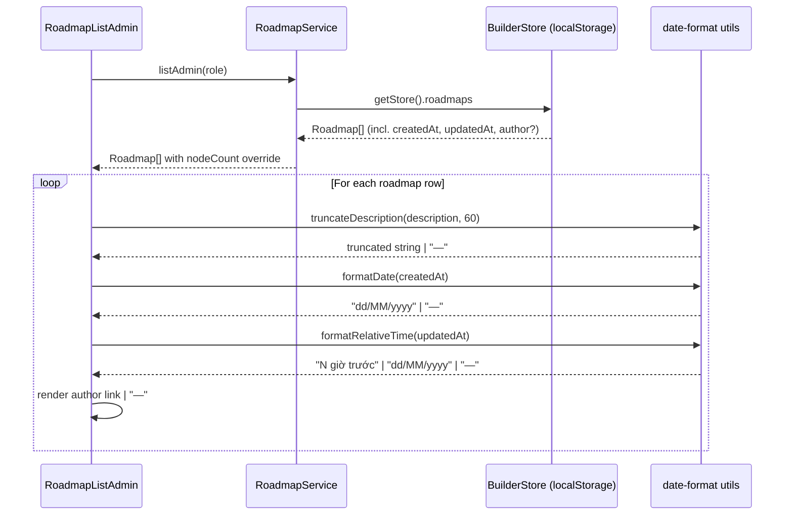

# Design Document: roadmap-detail-columns

## Overview

Tính năng bổ sung 4 cột thông tin (Mô tả, Tác giả, Ngày tạo, Cập nhật) vào bảng `RoadmapListAdmin`, mở rộng từ 5 lên 9 cột. Để hỗ trợ việc hiển thị, kiểu `Roadmap` được mở rộng thêm các trường `createdAt`, `updatedAt`, `authorId`, và đối tượng `author` nhúng tùy chọn. Toàn bộ thay đổi nằm trong `packages/core/src/roadmap` và không ảnh hưởng đến ứng dụng phía người dùng (`apps/web`).

---

## Architecture

### Nơi thay đổi và lý do

| Layer | File | Lý do |
|---|---|---|
| Type | `roadmap/types.ts` | Nguồn sự thật cho tất cả shape — mọi thay đổi type bắt đầu từ đây |
| Mock data | `roadmap/mock/roadmaps.mock.ts` | Seed tĩnh được dùng bởi `builder-store.ts`; cần có giá trị mới để hiển thị trong dev |
| Service | `roadmap/roadmap.service.ts` | `createRoadmap` phải stamp `createdAt`/`updatedAt`/`authorId`; `updateRoadmap` phải bump `updatedAt` |
| Date utils | `roadmap/utils/date-format.ts` (mới) | Tách biệt logic định dạng ngày với component — testable, dùng lại được; không phụ thuộc thư viện ngoài |
| Component | `roadmap/builder/components/RoadmapListAdmin.tsx` | Thêm prop `authorBasePath`, định nghĩa cột mới, cập nhật `colSpan` |

**Không tạo thêm package hay shared hook mới** — phạm vi thay đổi nhỏ, nằm gọn trong feature `roadmap`.

`truncateDescription` đã tồn tại trong `utils/truncate-description.ts` và hỗ trợ tham số `max` — component sẽ gọi nó với `max = 60` thay vì tạo logic mới.

---

## Data Models

### `Roadmap` interface (packages/core/src/roadmap/types.ts)

```typescript
export interface Roadmap {
  id: string
  slug: string
  title: string
  description: string | null
  thumbnailUrl: string | null
  isPublished: boolean
  nodeCount: number
  // ── Metadata columns (Req 1) ─────────────────────────────────────────────
  /** ISO 8601 timestamp. Optional so old localStorage snapshots stay valid. */
  createdAt?: string
  /** ISO 8601 timestamp. Optional so old localStorage snapshots stay valid. */
  updatedAt?: string
  /**
   * ID of the user who created this roadmap. Optional; used when the full
   * `author` object is not available (e.g. in slim API responses).
   */
  authorId?: string
  /**
   * Embedded author object. When present, preferred over bare `authorId`.
   * Optional: may be absent in legacy data or public-facing responses.
   */
  author?: { id: string; name: string }
}
```

**Tại sao optional (`?`) thay vì required:** Các trường mới là `optional` để đảm bảo tương thích ngược với dữ liệu trong localStorage (key `roadmap-builder:store:v1`) đã được serialize trước khi tính năng này triển khai. Xem phần [Type Safety & Backward Compatibility](#type-safety-and-backward-compatibility).

**`author` vs `authorId`:** Thiết kế hỗ trợ cả hai để sẵn sàng cho tương lai khi API trả về slim response (chỉ `authorId`) hoặc full response (đối tượng `author`). Component hiển thị theo thứ ưu tiên: `author` → `authorId` để xây dựng link → `—`.

---

## Mock Data Strategy

### `MOCK_ROADMAPS` (packages/core/src/roadmap/mock/roadmaps.mock.ts)

Mỗi entry được bổ sung `createdAt`, `updatedAt`, và `author` nhúng với dữ liệu thực tế để kiểm tra đầy đủ các nhánh hiển thị:

```typescript
// Các mock author dùng lại để giữ mock gọn
const MOCK_AUTHORS = {
  linh: { id: "user-001", name: "Nguyễn Thị Linh" },
  minh: { id: "user-002", name: "Trần Văn Minh" },
  system: { id: "user-000", name: "System" },
} as const

export const MOCK_ROADMAPS: Roadmap[] = [
  {
    id: "rm-frontend",
    // ... existing fields ...
    createdAt: "2024-01-15T08:00:00.000Z",
    updatedAt: "2024-06-20T14:30:00.000Z",   // > 24h → shows dd/MM/yyyy
    authorId: MOCK_AUTHORS.linh.id,
    author: MOCK_AUTHORS.linh,
  },
  {
    id: "rm-backend",
    // ...
    createdAt: "2024-02-10T10:00:00.000Z",
    updatedAt: new Date(Date.now() - 2 * 60 * 60 * 1000).toISOString(), // 2h ago → "2 giờ trước"
    authorId: MOCK_AUTHORS.minh.id,
    author: MOCK_AUTHORS.minh,
  },
  {
    id: "rm-devops",
    // ...
    createdAt: "2023-11-01T09:00:00.000Z",
    updatedAt: new Date(Date.now() - 30 * 60 * 1000).toISOString(),     // 30m ago → "30 phút trước"
    authorId: MOCK_AUTHORS.system.id,
    author: MOCK_AUTHORS.system,
  },
  {
    id: "rm-ai",
    // ...
    createdAt: "2025-03-05T12:00:00.000Z",
    updatedAt: "2025-03-05T12:00:00.000Z",
    authorId: MOCK_AUTHORS.linh.id,
    author: MOCK_AUTHORS.linh,
  },
]
```

**Lựa chọn giá trị mock:**
- `rm-backend`: `updatedAt` = 2 giờ trước → kiểm tra nhánh relative time `< 24h`
- `rm-devops`: `updatedAt` = 30 phút trước → kiểm tra đơn vị "phút"
- `rm-frontend`, `rm-ai`: `updatedAt` cố định → kiểm tra nhánh dd/MM/yyyy

**Lưu ý:** Dùng `new Date(Date.now() - N).toISOString()` thay vì timestamp cứng cho các mock cần relative time, để giá trị luôn đúng lúc render — không phụ thuộc ngày chạy.

---

## Service Changes

### `createRoadmap` — stamp `createdAt`, `updatedAt`, `authorId`

```typescript
// Trong CreateRoadmapInput: thêm authorId optional
export interface CreateRoadmapInput {
  slug: string
  title: string
  description?: string
  thumbnailUrl?: string
  authorId?: string   // mới
}

// Trong RoadmapService.createRoadmap:
async createRoadmap(
  input: CreateRoadmapInput,
  callerRole: CallerRole
): Promise<Roadmap> {
  assertCanWrite(callerRole)
  await delay()
  const store = getStore()
  const now = new Date().toISOString()   // single timestamp for consistency
  const slug = input.slug.trim() || slugify(input.title)
  const roadmap: Roadmap = {
    id: newId("rm"),
    slug: store.roadmaps.some((r) => r.slug === slug)
      ? slugify(slug, { unique: true })
      : slug,
    title: input.title.trim().slice(0, MAX_TITLE_LENGTH),
    description: input.description?.trim() || null,
    thumbnailUrl: input.thumbnailUrl ?? null,
    isPublished: false,
    nodeCount: 0,
    createdAt: now,        // mới
    updatedAt: now,        // mới
    authorId: input.authorId,  // mới — undefined nếu không truyền
  }
  store.roadmaps.push(roadmap)
  persistStore()
  emitRoadmapUpdate(roadmap.id)
  return { ...roadmap }
}
```

### `updateRoadmap` — bump `updatedAt`

```typescript
async updateRoadmap(
  id: string,
  input: Partial<CreateRoadmapInput> & { isPublished?: boolean },
  callerRole: CallerRole
): Promise<Roadmap> {
  assertCanWrite(callerRole)
  await delay()
  const roadmap = getStore().roadmaps.find((r) => r.id === id)
  if (!roadmap) throw new RoadmapServiceError("NOT_FOUND")
  // ...existing field mutations...
  roadmap.updatedAt = new Date().toISOString()   // mới — bump on every write
  persistStore()
  emitRoadmapUpdate(id)
  return { ...roadmap }
}
```

### `listAdmin` — trả về `author` từ store

`listAdmin` hiện tại đã spread toàn bộ roadmap object và override `nodeCount`. Vì `author` sống trên object `Roadmap` trong store, nó tự động được trả về mà không cần thêm logic — không cần thay đổi signature hay body của `listAdmin`.

### `graphBySlug` — synthetic roadmap node

Khi tạo synthetic roadmap từ node slug, bổ sung `createdAt`/`updatedAt`/`authorId` với `undefined` (vì node không có thông tin tác giả). TypeScript chấp nhận vì các trường này là optional:

```typescript
roadmap: {
  id: node.id,
  slug: node.slug,
  title: node.title,
  description: node.description,
  thumbnailUrl: null,
  isPublished: true,
  nodeCount: subtree.length,
  // createdAt, updatedAt, authorId omitted → undefined — type-safe
},
```

---

## Utility Function Design

### `packages/core/src/roadmap/utils/date-format.ts` (file mới)

**Lý do tách thành file riêng:** Logic định dạng ngày cần được test độc lập (property-based tests), tái sử dụng được ở component khác, và không làm phình component. Đặt trong `utils/` theo convention của feature.

```typescript
const VI_DATE_FORMAT = new Intl.DateTimeFormat("vi-VN", {
  day: "2-digit",
  month: "2-digit",
  year: "numeric",
})

const VI_RTF = new Intl.RelativeTimeFormat("vi", { numeric: "auto" })

/** Milliseconds in each unit for relative time bucketing */
const MINUTE_MS = 60_000
const HOUR_MS = 3_600_000
const DAY_MS = 86_400_000

/**
 * Format an ISO 8601 date string as `dd/MM/yyyy` using Vietnamese locale.
 *
 * Returns `—` if `dateStr` is null/undefined/empty.
 *
 * Postcondition: result matches /^\d{2}\/\d{2}\/\d{4}$/ or equals `—`.
 */
export function formatDate(dateStr: string | null | undefined): string {
  if (!dateStr) return "—"
  const d = new Date(dateStr)
  if (isNaN(d.getTime())) return "—"
  return VI_DATE_FORMAT.format(d)
}

/**
 * Format an ISO 8601 date string as relative time (Vietnamese) when the date
 * is within the last 24 hours, otherwise fall back to `formatDate`.
 *
 * Thresholds:
 *   - < 60s   → "vừa xong"  (via Intl.RelativeTimeFormat "auto")
 *   - < 60m   → "N phút trước"
 *   - < 24h   → "N giờ trước"
 *   - ≥ 24h   → formatDate(dateStr)
 *
 * Returns `—` if `dateStr` is null/undefined/empty or invalid.
 *
 * Postcondition: when delta < DAY_MS, result contains a Vietnamese unit word
 * OR "vừa xong". When delta ≥ DAY_MS, result matches dd/MM/yyyy pattern.
 */
export function formatRelativeTime(
  dateStr: string | null | undefined,
  now: Date = new Date()
): string {
  if (!dateStr) return "—"
  const d = new Date(dateStr)
  if (isNaN(d.getTime())) return "—"
  const deltaMs = now.getTime() - d.getTime()
  if (deltaMs < 0) {
    // Future timestamp — fall back to absolute date
    return formatDate(dateStr)
  }
  if (deltaMs < DAY_MS) {
    if (deltaMs < MINUTE_MS) {
      return VI_RTF.format(0, "second") // → "vừa xong"
    }
    if (deltaMs < HOUR_MS) {
      const minutes = -Math.floor(deltaMs / MINUTE_MS)
      return VI_RTF.format(minutes, "minute")
    }
    const hours = -Math.floor(deltaMs / HOUR_MS)
    return VI_RTF.format(hours, "hour")
  }
  return formatDate(dateStr)
}
```

**Thiết kế `now` parameter:** `now` có default `new Date()` nhưng có thể inject — giúp các property tests kiểm soát thời gian tuyệt đối mà không cần mock global `Date`.

**Singletons `VI_DATE_FORMAT` và `VI_RTF`:** Khởi tạo một lần ở module scope thay vì mỗi lần gọi — `Intl` constructors không rẻ.

### Xuất qua barrel

`utils/index.ts` bổ sung:

```typescript
export * from "./date-format"
```

---

## Components and Interfaces

### `RoadmapListAdmin` — props mới

```typescript
interface RoadmapListAdminProps {
  role: CallerRole
  /** Builder route prefix; rows link to `${builderBasePath}/${id}`. */
  builderBasePath?: string
  /**
   * Base path for author profile links. Author cells link to
   * `${authorBasePath}/${authorId}`. Configurable so admin vs super-admin apps
   * can each point to their own user-detail route.
   *
   * @default "/super-admin/users"
   */
  authorBasePath?: string
}
```

**Lý do dùng prop thay vì hardcode:** URL `/super-admin/users/{id}` là cross-app — `packages/core` không nên biết về cấu trúc route của từng ứng dụng. Prop với default an toàn giữ component reusable.

### Định nghĩa cột (9 cột theo thứ tự)

```typescript
// Header row
<TableRow>
  <TableHead>Tên</TableHead>
  <TableHead>Mô tả</TableHead>
  <TableHead>Slug</TableHead>
  <TableHead>Tác giả</TableHead>
  <TableHead>Ngày tạo</TableHead>
  <TableHead>Cập nhật</TableHead>
  <TableHead className="text-right">Nodes</TableHead>
  <TableHead className="text-center">Xuất bản</TableHead>
  <TableHead className="text-right">Hành động</TableHead>
</TableRow>
```

### Rendering logic cho từng cột mới

**Cột Mô tả:**
```typescript
<TableCell className="text-muted-foreground max-w-[200px]">
  {roadmap.description
    ? truncateDescription(roadmap.description, 60)
    : "—"}
</TableCell>
```
Dùng `truncateDescription` có sẵn với `max = 60`. Khi `description` là `null` hoặc chuỗi rỗng (falsy), hiển thị `—`.

**Cột Tác giả:**
```typescript
<TableCell onClick={(e) => e.stopPropagation()}>
  {roadmap.author ?? roadmap.authorId ? (
    <a
      href={`${authorBasePath}/${(roadmap.author?.id ?? roadmap.authorId)!}`}
      className="text-primary underline-offset-4 hover:underline"
    >
      {roadmap.author?.name ?? roadmap.authorId}
    </a>
  ) : (
    "—"
  )}
</TableCell>
```
`e.stopPropagation()` ngăn click link kích hoạt row-click → builder navigation. Ưu tiên `author.name` để hiển thị, fallback về `authorId` khi không có embedded object.

**Cột Ngày tạo:**
```typescript
<TableCell>{formatDate(roadmap.createdAt)}</TableCell>
```

**Cột Cập nhật:**
```typescript
<TableCell>{formatRelativeTime(roadmap.updatedAt)}</TableCell>
```

**Cập nhật empty-state colspan:**
```typescript
<TableCell colSpan={9} className="text-center text-muted-foreground">
  Chưa có roadmap nào — hãy tạo roadmap đầu tiên.
</TableCell>
```

### Import thêm

```typescript
import { formatDate, formatRelativeTime } from "../../utils/date-format"
import { truncateDescription } from "../../utils/truncate-description"
```

---

## Type Safety and Backward Compatibility

### Vấn đề localStorage

`builder-store.ts` dùng key `roadmap-builder:store:v1`. Dữ liệu serialize trước khi feature này được deploy sẽ không có các trường `createdAt`, `updatedAt`, `authorId`, `author`.

**Giải pháp — không thay đổi `isStoreShape`:**

Vì các trường mới đều là `optional` (`?`) trên interface `Roadmap`, TypeScript chấp nhận objects thiếu chúng là `Roadmap` hợp lệ. Guard `isStoreShape` chỉ kiểm tra `Array.isArray(v.roadmaps) && Array.isArray(v.nodes)` — không cần thay đổi.

**Defensive rendering trong component:**

```typescript
// formatDate và formatRelativeTime đã xử lý undefined/null → "—"
formatDate(roadmap.createdAt)           // undefined → "—" ✓
formatRelativeTime(roadmap.updatedAt)   // undefined → "—" ✓

// Author cell: optional chaining đảm bảo không có runtime error
roadmap.author ?? roadmap.authorId      // cả hai undefined → "—" ✓
```

Kết quả: người dùng đang có dữ liệu cũ trong localStorage sẽ thấy `—` ở các cột mới thay vì lỗi runtime.

### `graphBySlug` synthetic roadmap

Object tạo inline trong `graphBySlug` không khai báo `createdAt`/`updatedAt`/`authorId` — TypeScript không báo lỗi vì optional. Giữ nguyên, không cần thay đổi.

### `CreateRoadmapInput` thay đổi

`authorId` được thêm vào `CreateRoadmapInput` dưới dạng optional. Caller hiện tại (`CreateRoadmapDialog`) không truyền `authorId` — sau khi thêm, field này sẽ là `undefined` và được propagate lên `Roadmap.authorId: undefined`. Không có breaking change.

---

## Sequence Diagram — Luồng hiển thị cột mới



---

## Correctness Properties

Các property này dùng để viết property-based tests (framework: `fast-check`). Vì không có test runner được cấu hình, các properties được phát biểu tại đây như đặc tả hành vi và sẽ được implement khi test infrastructure được bổ sung.

### Property 1: `formatDate` — đầu vào hợp lệ luôn cho ra `dd/MM/yyyy`

**Validates: Requirements 4.2, 5.3**

```
∀ d: Date where !isNaN(d.getTime())
  formatDate(d.toISOString()) matches /^\d{2}\/\d{2}\/\d{4}$/
```

### Property 2: `formatDate` — đầu vào không hợp lệ luôn cho ra `—`

**Validates: Requirements 4.2**

```
∀ s: string | null | undefined where s ∈ {null, undefined, "", "not-a-date", "abc"}
  formatDate(s) === "—"
```

### Property 3: `formatRelativeTime` — delta < 24h → chứa đơn vị thời gian tiếng Việt hoặc "vừa xong"

**Validates: Requirements 5.2**

```
∀ d: Date, now: Date where 0 ≤ (now - d) < 86_400_000
  formatRelativeTime(d.toISOString(), now)
    ∈ { strings containing "giờ" | "phút" | "giây" | "vừa xong" }
```

### Property 4: `formatRelativeTime` — delta ≥ 24h → kết quả giống `formatDate`

**Validates: Requirements 5.3**

```
∀ d: Date, now: Date where (now - d) ≥ 86_400_000
  formatRelativeTime(d.toISOString(), now) === formatDate(d.toISOString())
```

### Property 5: `formatRelativeTime` — timestamp tương lai → fallback về `formatDate`

**Validates: Requirements 5.3**

```
∀ d: Date, now: Date where d > now
  formatRelativeTime(d.toISOString(), now) === formatDate(d.toISOString())
```

### Property 6: `truncateDescription` (max=60) — kết quả không vượt quá 60 ký tự

**Validates: Requirements 2.2**

```
∀ s: string where s.length > 0
  truncateDescription(s, 60).length ≤ 60
```

### Property 7: `truncateDescription` (max=60) — kết thúc bằng `…` khi input > 60 ký tự

**Validates: Requirements 2.2**

```
∀ s: string where s.trim().length > 60
  truncateDescription(s, 60).endsWith("…")
```

### Property 8: Thứ tự cột trong DOM

**Validates: Requirements 6.1**

```
Thứ tự headers trong DOM =
  ["Tên", "Mô tả", "Slug", "Tác giả", "Ngày tạo", "Cập nhật", "Nodes", "Xuất bản", "Hành động"]
```

### Property 9: `colSpan` empty-state bằng tổng số cột

**Validates: Requirements 6.2**

```
colSpan của TableCell empty-state === số TableHead trong header row === 9
```

### Property 10: Author cell không kích hoạt row navigation

**Validates: Requirements 3.3**

```
∀ click: MouseEvent on author <a> element
  event.stopPropagation() đã được gọi
  → window.location.href không thay đổi về builderBasePath
```

---

## Error Handling

### `formatDate` và `formatRelativeTime` — đầu vào không hợp lệ

**Điều kiện**: `dateStr` là `null`, `undefined`, chuỗi rỗng, hoặc chuỗi không parse được thành Date hợp lệ (`isNaN(new Date(s).getTime())`).

**Phản hồi**: Cả hai hàm trả về chuỗi `"—"` thay vì ném ngoại lệ.

**Phục hồi**: Không cần — UI hiển thị `—` là trạng thái hợp lệ.

### Cột Tác giả — thiếu `author` và `authorId`

**Điều kiện**: Roadmap được load từ localStorage cũ không có trường `author` hoặc `authorId` (cả hai là `undefined`).

**Phản hồi**: Component kiểm tra `roadmap.author ?? roadmap.authorId` — cả hai falsy → hiển thị `"—"`, không render `<a>` tag.

**Phục hồi**: Không có lỗi runtime. Dữ liệu sẽ được cập nhật tự nhiên khi admin chỉnh sửa roadmap (lúc đó `updateRoadmap` stamp `updatedAt` mới).

### `createRoadmap` — `authorId` không bắt buộc

**Điều kiện**: Caller không truyền `authorId` vào `CreateRoadmapInput`.

**Phản hồi**: `roadmap.authorId` sẽ là `undefined`. Service không ném lỗi. Cột Tác giả trong list hiển thị `—`.

**Phục hồi**: Admin có thể cập nhật roadmap sau, hoặc hệ thống thực (GraphQL) sẽ tự gán `authorId` từ context authentication.

---

## Testing Strategy

### Unit tests (khi có test runner)

- `formatDate`: valid ISO, invalid string, null, undefined, future date
- `formatRelativeTime`: 0s ago, 30m ago, 2h ago, exactly 24h, 25h ago, future, invalid
- `truncateDescription` với `max=60`: empty, 59 chars, exactly 60, 61 chars, 120 chars

### Property-based tests (fast-check)

Properties 1–10 phát biểu trong phần Correctness Properties. Khi test infrastructure được thiết lập, dùng `fast-check`:

```typescript
import * as fc from "fast-check"
import { formatDate, formatRelativeTime } from "../utils/date-format"
import { truncateDescription } from "../utils/truncate-description"

// Property 1: valid date → dd/MM/yyyy
fc.assert(fc.property(fc.date(), (d) => {
  const result = formatDate(d.toISOString())
  return /^\d{2}\/\d{2}\/\d{4}$/.test(result)
}))

// Property 6: truncate never exceeds max
fc.assert(fc.property(fc.string({ minLength: 1 }), (s) => {
  return truncateDescription(s, 60).length <= 60
}))

// Property 4: delta ≥ 24h → same as formatDate
const DAY_MS = 86_400_000
fc.assert(fc.property(
  fc.date(),
  fc.integer({ min: DAY_MS, max: DAY_MS * 365 }),
  (d, delta) => {
    const now = new Date(d.getTime() + delta)
    return formatRelativeTime(d.toISOString(), now) === formatDate(d.toISOString())
  }
))
```

**Property-Based Test Library**: fast-check

### Type safety

- `pnpm typecheck` phải pass sau khi thêm `createdAt?`, `updatedAt?`, `authorId?`, `author?` vào `Roadmap`
- Không có `any` mới
- Không có `!` (non-null assertion) trừ trường hợp đã có guard rõ ràng trước đó

---

## Dependencies

Không có dependency mới. Tính năng dùng:
- `Intl.DateTimeFormat` — Web standard, có sẵn trong Node ≥ 20 và mọi browser hiện đại
- `Intl.RelativeTimeFormat` — Web standard, có sẵn trong Node ≥ 12 và mọi browser hiện đại
- `truncateDescription` — đã có trong `utils/truncate-description.ts`
- `@workspace/ui` — đã được import trong component
- `lucide-react` — đã được import trong component
