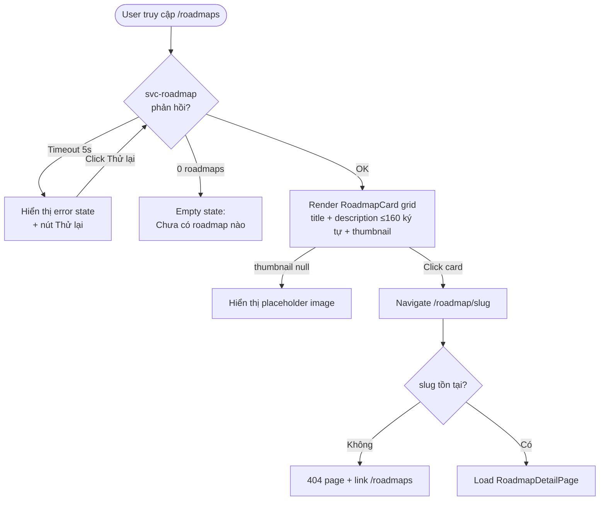
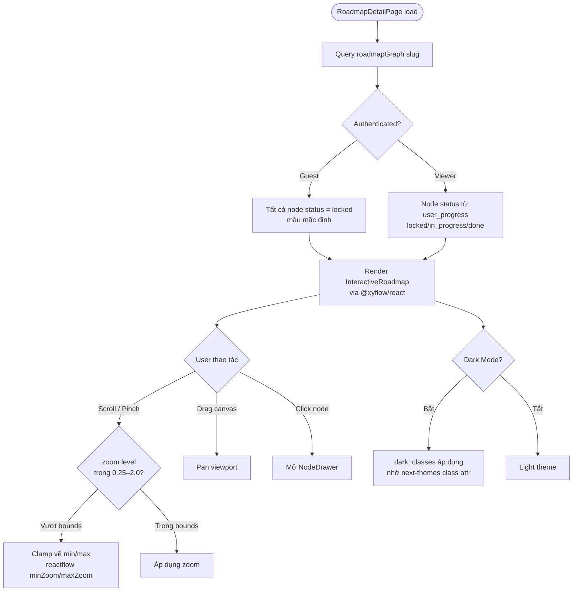
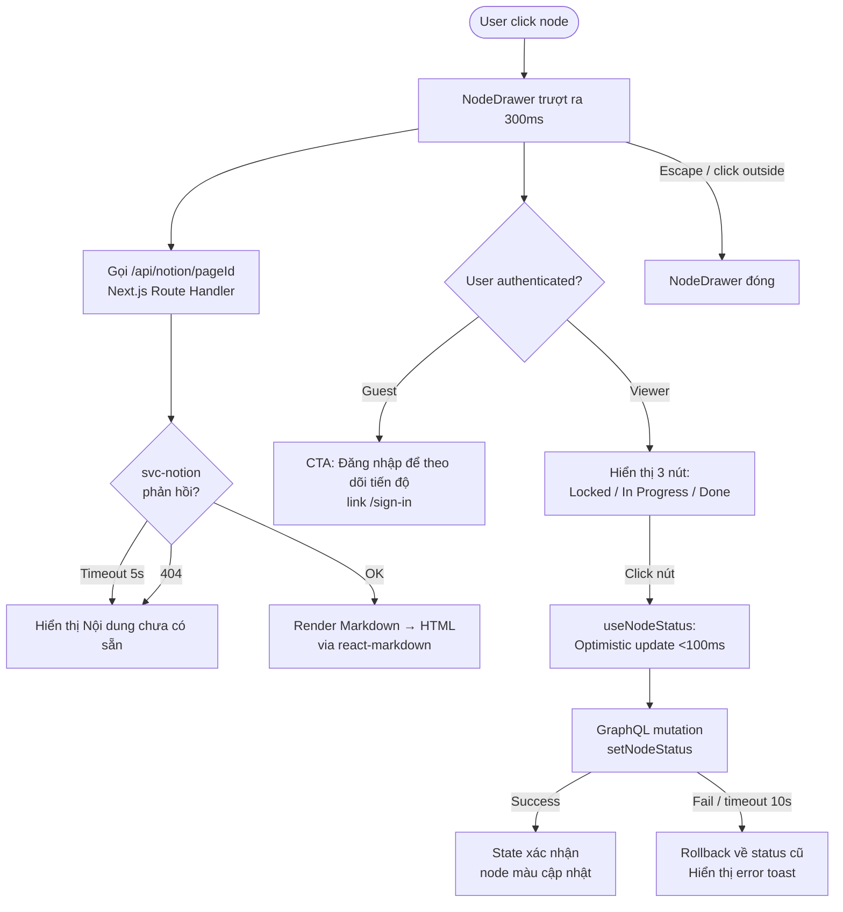
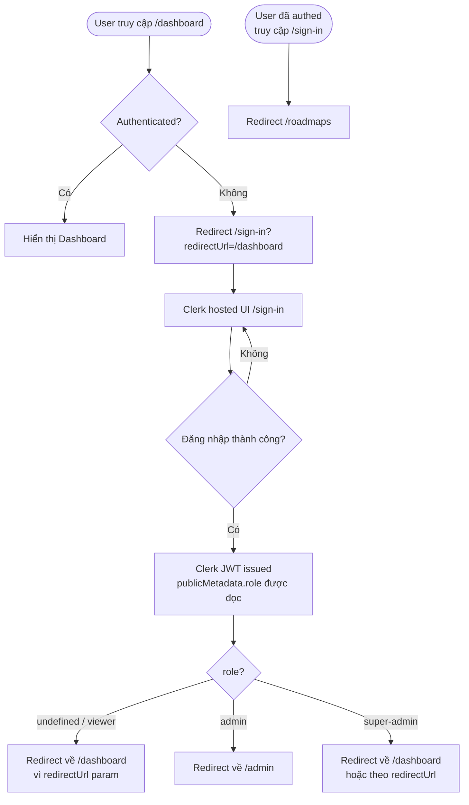
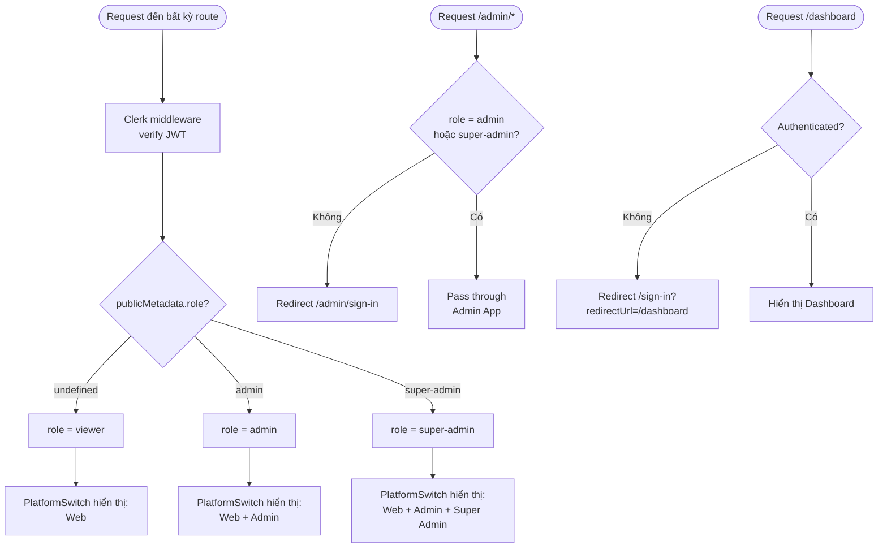
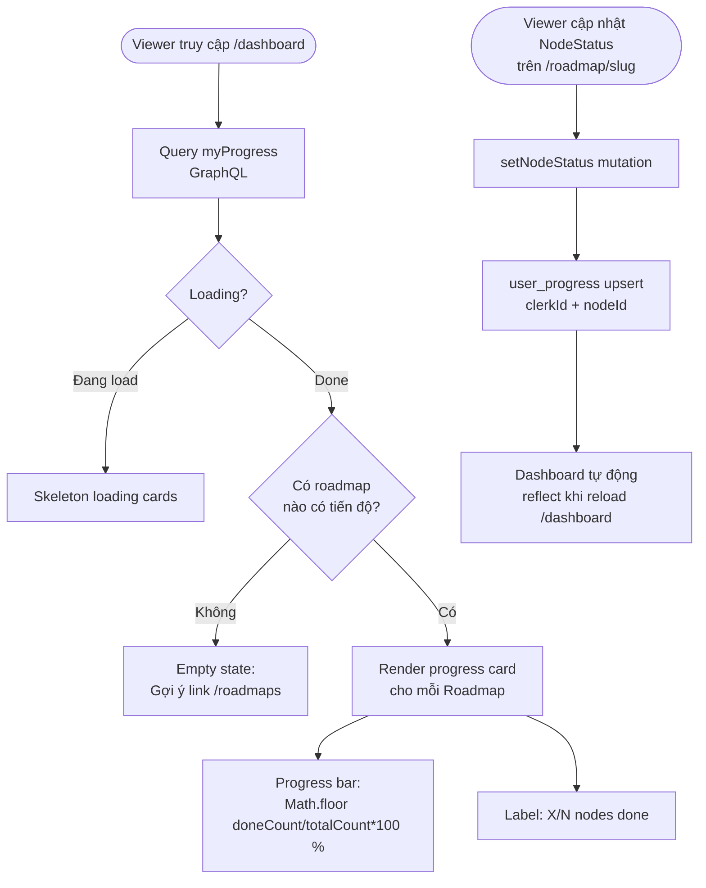
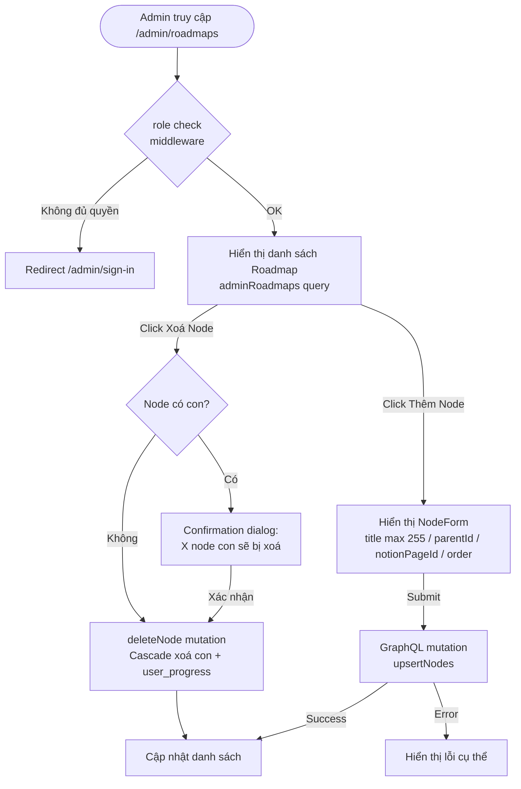

# Design Document: Roadmap Platform

## Overview

Roadmap Platform là bản clone của [roadmap.sh](https://roadmap.sh) — nền tảng học lập trình theo lộ trình có cấu trúc. Hệ thống cho phép người dùng khám phá các roadmap học tập dạng sơ đồ cây tương tác, theo dõi tiến độ cá nhân, và đọc nội dung bài học từ Notion.

### Nguyên tắc thiết kế

- **Domain-first**: Logic nghiệp vụ tập trung tại `packages/core` (feature-first). Apps chỉ import và tùy chỉnh.
- **Type-safe end-to-end**: GraphQL Codegen sinh TypeScript types từ schema → không có type mismatch giữa FE và BE.
- **Multi-Zone by rewrites**: `apps/web` làm host, proxy `/admin` và `/super-admin` qua `rewrites()` trong `next.config.ts`.
- **Clerk-first auth**: Không có auth session tự build. Role được đọc từ `publicMetadata.role` trong Clerk JWT.

---

## Architecture

### Tổng quan hệ thống

```
┌─────────────────────────────────────────────────────────────────────┐
│                        Browser / Client                              │
└───────────┬─────────────────────────────────────────────────────────┘
            │ HTTPS
            ▼
┌─────────────────────────────────────────────────────────────────────┐
│              apps/web — Next.js 16 (port 3000, host zone)            │
│   /roadmaps, /roadmap/[slug], /dashboard, /sign-in, /sign-up         │
│   rewrites: /admin → apps/admin, /super-admin → apps/super-admin     │
└───────────┬─────────────────────────────────────────────────────────┘
            │                         │
  /admin    │                /super-admin
            ▼                         ▼
┌───────────────────┐     ┌────────────────────────┐
│  apps/admin       │     │  apps/super-admin       │
│  Next.js 16       │     │  Next.js 16             │
│  port 3002        │     │  port 3003              │
│  basePath=/admin  │     │  basePath=/super-admin  │
└───────────────────┘     └────────────────────────┘
            │                         │
            └──────────┬──────────────┘
                       │ GraphQL (Apollo Client)
                       ▼
┌─────────────────────────────────────────────────────────────────────┐
│  apps/svc-roadmap — NestJS (port 3005)                               │
│  /graphql (Apollo Server)  │  /api-docs (Swagger, docs-only)         │
│  /webhooks/clerk           │  /health                                 │
│  ClerkAuthGuard + RolesGuard                                         │
└───────────┬─────────────────────────────────────────────────────────┘
            │ Prisma ORM              │ HTTP (internal)
            ▼                         ▼
┌──────────────────┐     ┌────────────────────────────────────────────┐
│  PostgreSQL       │     │  apps/svc-notion — Hono (port 3004)        │
│  (Supabase)       │     │  Notion API integration                    │
│  packages/db      │     │  Parses Notion pages → Markdown            │
└──────────────────┘     └────────────────────────────────────────────┘
```

### Monorepo Structure

```
tlh222k/
├── apps/
│   ├── web/                  # Public app (port 3000) — Guest + Viewer
│   ├── admin/                # Admin app (port 3002, basePath=/admin)
│   ├── super-admin/          # Super-Admin app (port 3003, basePath=/super-admin)
│   ├── svc-roadmap/          # NestJS backend (port 3005)
│   └── svc-notion/           # Hono service (port 3004)
├── packages/
│   ├── core/                 # Shared domain logic (feature-first)
│   │   └── src/
│   │       └── roadmap/      # Tính năng chính (submodule: IDISAI/roadmap)
│   │           ├── index.ts                  # barrel export
│   │           ├── types.ts                  # NodeStatus, Roadmap, RoadmapNode, RoadmapGraph
│   │           ├── roadmap.service.ts         # domain service
│   │           ├── components/               # RoadmapView, RoadmapCard
│   │           ├── hooks/                    # useRoadmap
│   │           ├── utils/
│   │           ├── graph/                    # sub-feature: Interactive diagram
│   │           │   ├── components/
│   │           │   │   ├── InteractiveRoadmap.tsx
│   │           │   │   └── RoadmapNodeComponent.tsx
│   │           │   └── utils/
│   │           │       └── buildEdges.ts
│   │           ├── drawer/                   # sub-feature: Node content drawer
│   │           │   ├── components/
│   │           │   │   └── NodeDrawer.tsx
│   │           │   └── hooks/
│   │           │       └── use-notion-content.ts
│   │           ├── progress/                 # sub-feature: Progress tracking
│   │           │   ├── components/
│   │           │   │   └── StatusButtons.tsx
│   │           │   └── hooks/
│   │           │       └── use-node-status.ts
│   │           ├── dashboard/                # sub-feature: Progress overview
│   │           │   └── components/
│   │           │       └── DashboardPage.tsx
│   │           ├── navigation/               # sub-feature: Cross-zone navigation
│   │           │   ├── PlatformSwitch.tsx
│   │           │   └── ThemeToggle.tsx
│   │           └── graphql/                  # sub-feature: Generated types
│   │               └── generated.ts          # from GraphQL Codegen
│   ├── db/                   # Prisma schema + client (@workspace/db)
│   ├── ui/                   # shadcn/ui components (submodule: IDISAI/ui)
│   ├── eslint-config/
│   └── typescript-config/
```

**Lý do tổ chức sub-features trong `roadmap/`:**

| Sub-feature   | Quan hệ với `roadmap`                                        | Lý do gộp vào                            |
| ------------- | ------------------------------------------------------------ | ---------------------------------------- |
| `graph/`      | Render trực tiếp `RoadmapNode[]`                             | Không tái sử dụng ngoài roadmap          |
| `drawer/`     | Hiển thị chi tiết của 1 `RoadmapNode`                        | Phụ thuộc vào `RoadmapNode.notionPageId` |
| `progress/`   | Cập nhật `NodeStatus` cho `RoadmapNode`                      | State gắn với `nodeId` — roadmap domain  |
| `dashboard/`  | Tổng hợp `RoadmapProgress[]` theo roadmap                    | Query `myProgress` — roadmap-scoped      |
| `navigation/` | `PlatformSwitch` dùng trong tất cả app headers; cùng package | Shared UI, không app-specific            |
| `graphql/`    | Generated types từ schema của svc-roadmap                    | Types thuộc roadmap domain               |

### Package dependency rule

```
apps/* → packages/*   ✅ allowed
packages/* → apps/*   ❌ never
```

All `packages/*` use scope `@workspace/*` (e.g., `@workspace/core`, `@workspace/db`, `@workspace/ui`).

### Multi-Zone Next.js Setup

`apps/web` là host zone. Nó proxy các zone con thông qua `rewrites()` trong `next.config.ts`:

```ts
// apps/web/next.config.ts (hiện tại)
async rewrites() {
  return [
    { source: "/admin",       destination: `${ADMIN_URL}/admin` },
    { source: "/admin/:path*", destination: `${ADMIN_URL}/admin/:path*` },
    { source: "/super-admin", destination: `${SUPER_ADMIN_URL}/super-admin` },
    { source: "/super-admin/:path*", destination: `${SUPER_ADMIN_URL}/super-admin/:path*` },
  ]
}
```

- `ADMIN_URL` / `SUPER_ADMIN_URL`: env vars, default đến localhost ports khi dev, Vercel URLs khi prod.
- Mỗi child app có `basePath` tương ứng trong `next.config.ts`.
- Navigation xuyên zone dùng `<a href="...">` root-absolute, **không** dùng Next.js `<Link>`.

---

## UI/UX Flows

Section này gồm hai lớp:

1. **ASCII Wireframes** — layout thực tế của từng màn hình
2. **Mermaid Flowcharts** — luồng logic và điều kiện chạy qua các màn hình

---

### ASCII Wireframes

#### Screen 1: `/roadmaps` — Danh sách Roadmap

```
┌─────────────────────────────────────────────────────────────────────┐
│  LOGO    [Web]                                    [☀/☾]  [Sign In]  │  ← Header (apps/web)
│          PlatformSwitch (viewer: chỉ Web)                            │
├─────────────────────────────────────────────────────────────────────┤
│                                                                       │
│   Learn to code  —  Choose your path                                 │
│                                                                       │
│   ┌─────────────────┐  ┌─────────────────┐  ┌─────────────────┐    │
│   │ [thumbnail]     │  │ [thumbnail]     │  │ [thumbnail]     │    │
│   │─────────────────│  │─────────────────│  │─────────────────│    │
│   │ Frontend Dev    │  │ Backend Dev     │  │ DevOps          │    │
│   │ Learn HTML, CSS │  │ Node.js, DB...  │  │ Docker, CI/CD...│    │
│   │ <160 chars      │  │ <160 chars      │  │ <160 chars      │    │  ← RoadmapCard
│   └─────────────────┘  └─────────────────┘  └─────────────────┘    │
│                                                                       │
│   ┌─────────────────┐  ┌─────────────────┐  ...                    │
│   │ [thumbnail]     │  │ [placeholder 🖼] │                          │  ← thumbnail null → placeholder
│   │─────────────────│  │─────────────────│                          │
│   │ React           │  │ System Design   │                          │
│   └─────────────────┘  └─────────────────┘                          │
│                                                                       │
├─────────────────────────────────────────────────────────────────────┤
│  STATE: Empty          │  STATE: Error                               │
│  ┌───────────────┐     │  ┌─────────────────────────┐               │
│  │ 📭            │     │  │ ⚠ Không thể tải dữ liệu │               │
│  │ Chưa có       │     │  │ [  Thử lại  ]           │               │
│  │ roadmap nào   │     │  └─────────────────────────┘               │
│  └───────────────┘     │                                             │
└─────────────────────────────────────────────────────────────────────┘
```

---

#### Screen 2: `/roadmap/[slug]` — Interactive Roadmap

```
┌─────────────────────────────────────────────────────────────────────┐
│  LOGO    [Web]                                  [☀/☾]  [User ▼]    │  ← Header
├─────────────────────────────────────────────────────────────────────┤
│  Frontend Developer Roadmap                    [⊕ Zoom In] [⊖ Out] │
├───────────────────────────────────────────────┬─────────────────────┤
│                                               │                     │
│        ┌──────────────┐                       │  NodeDrawer         │
│        │   Internet   │  ← locked (default)   │  (ẩn mặc định,     │
│        └──────┬───────┘                       │   slide in khi     │
│               │                               │   click node)      │
│        ┌──────┴───────┐                       │                     │
│        │     HTML     │  ← done (xanh lá) ✓  │                     │
│        └──────┬───────┘                       │                     │
│        ┌──────┴───────┐                       │                     │
│        │     CSS      │  ← in_progress (vàng) │                     │
│        └──────┬───────┘                       │                     │
│        ┌──────┴───────┐                       │                     │
│        │  JavaScript  │  ← locked             │                     │
│        └──────────────┘                       │                     │
│                                               │                     │
│  [drag để pan]  zoom: 25%──────●──── 200%    │                     │
├───────────────────────────────────────────────┴─────────────────────┤
│  LEGEND:  ▢ Locked   🟨 In Progress   🟩 Done                       │
└─────────────────────────────────────────────────────────────────────┘

COLOR MAPPING (packages/core/src/roadmap/graph/):
  locked      → bg-muted / text-muted-foreground
  in_progress → bg-yellow-400 dark:bg-yellow-500
  done        → bg-green-500  dark:bg-green-600
```

---

#### Screen 3: NodeDrawer — trạng thái Guest vs Viewer

````
┌────────────────────────────────────────────┬──────────────────────┐
│  Interactive Roadmap (dimmed backdrop)     │ ← 300ms slide-in     │
│                                            │──────────────────────│
│                                            │ CSS                  │  ← Node title
│                                            │──────────────────────│
│                                            │ [skeleton loading]   │  ← while fetching Notion
│                                            │                      │
│                                            │ ─── after load ───   │
│                                            │                      │
│                                            │ ## Giới thiệu CSS    │
│                                            │ CSS (Cascading Style │
│                                            │ Sheets) là ngôn...   │  ← Markdown → HTML
│                                            │                      │
│                                            │ ### Cú pháp          │
│                                            │ ```css               │
│                                            │ selector { prop: v } │
│                                            │ ```                  │
│                                            │                      │
│                                            │ ──────────────────── │
│  GUEST:                                    │ VIEWER:              │
│  ┌──────────────────────────────────────┐  │ ┌──────────────────┐ │
│  │ 🔒 Đăng nhập để theo dõi tiến độ    │  │ │[Locked][InProg✓][Done]│
│  │ → /sign-in                           │  │ └──────────────────┘ │
│  └──────────────────────────────────────┘  │                      │
│                                            │  [✕ Escape / click   │
│                                            │   outside để đóng]   │
└────────────────────────────────────────────┴──────────────────────┘

DRAWER WIDTH:  ~420px  |  ANIMATION: transform translateX(100%) → 0  |  DURATION: 300ms
````

---

#### Screen 4: `/dashboard` — Tổng quan tiến độ

```
┌─────────────────────────────────────────────────────────────────────┐
│  LOGO    [Web]                                  [☀/☾]  [User ▼]    │
├─────────────────────────────────────────────────────────────────────┤
│  My Learning Progress                                                │
│                                                                       │
│  ┌───────────────────────────────────────────────────────────────┐  │
│  │  Frontend Developer                            12/45 nodes done│  │
│  │  ████████████░░░░░░░░░░░░░░░░░░░░░░░░░░░░    26%             │  │  ← Math.floor(12/45*100)
│  └───────────────────────────────────────────────────────────────┘  │
│                                                                       │
│  ┌───────────────────────────────────────────────────────────────┐  │
│  │  Backend Developer                              3/60 nodes done│  │
│  │  ██░░░░░░░░░░░░░░░░░░░░░░░░░░░░░░░░░░░░░░░     5%            │  │
│  └───────────────────────────────────────────────────────────────┘  │
│                                                                       │
│  STATE: Loading              │  STATE: Empty                         │
│  ┌─────────────────────┐     │  ┌───────────────────────────────┐   │
│  │ [████████░░░░░░░░] │     │  │ 🎯 Bắt đầu học ngay!          │   │
│  │ [█████░░░░░░░░░░░] │     │  │ Khám phá các lộ trình học →   │   │
│  │ [███░░░░░░░░░░░░░] │     │  │ [  Xem Roadmaps  ]            │   │
│  └─────────────────────┘     │  └───────────────────────────────┘   │
│     ← skeleton cards          │                                       │
└─────────────────────────────────────────────────────────────────────┘

PROGRESS BAR: width = Math.floor(doneCount / totalCount * 100) + "%"
Chỉ hiện roadmap khi có ít nhất 1 node status ≠ locked
```

---

#### Screen 5: Header — PlatformSwitch theo role

```
GUEST / VIEWER:
┌─────────────────────────────────────────────────────────────────────┐
│  LOGO   [Web ←active]                            [☀/☾]  [Sign In]  │
└─────────────────────────────────────────────────────────────────────┘

ADMIN:
┌─────────────────────────────────────────────────────────────────────┐
│  LOGO   [Web] [Admin ←active]                    [☀/☾]  [User ▼]  │
│         (root-absolute <a href>)                                     │
└─────────────────────────────────────────────────────────────────────┘

SUPER-ADMIN:
┌─────────────────────────────────────────────────────────────────────┐
│  LOGO   [Web] [Admin] [Super Admin ←active]      [☀/☾]  [User ▼]  │
└─────────────────────────────────────────────────────────────────────┘

ACTIVE TAB STYLE: font-weight: bold, text-decoration: underline, aria-current="page"
CROSS-ZONE NAV: <a href="/admin"> — NOT Next.js <Link>
```

---

#### Screen 6: `/admin/roadmaps/[id]` — Quản lý Node

```
┌─────────────────────────────────────────────────────────────────────┐
│  LOGO   [Web] [Admin ←active]                    [☀/☾]  [User ▼]  │
├─────────────────────────────────────────────────────────────────────┤
│  ← Roadmaps /  Frontend Developer                   [+ Thêm Node]  │
├────────────────────────────┬────────────────────────────────────────┤
│  NODE TREE                 │  EDIT PANEL                            │
│  ─────────────             │  ─────────────────────────             │
│  ▼ Internet                │  Title *                               │
│      ▼ HTML                │  ┌──────────────────────────────┐     │
│          CSS               │  │ CSS                          │     │  ← max 255 chars
│          JavaScript        │  └──────────────────────────────┘     │
│      Backend               │                                        │
│  ─────────────             │  Parent Node                           │
│  [+ Thêm Node]             │  ┌──────────────────────────────┐     │
│                            │  │ HTML              [▼]        │     │
│                            │  └──────────────────────────────┘     │
│                            │                                        │
│                            │  Notion Page ID                        │
│                            │  ┌──────────────────────────────┐     │
│                            │  │ abc123xyz...                 │     │
│                            │  └──────────────────────────────┘     │
│                            │                                        │
│                            │  Order   ┌─────┐                      │
│                            │          │  3  │                      │
│                            │          └─────┘                      │
│                            │                                        │
│                            │  [  Lưu  ]   [🗑 Xoá]                 │
└────────────────────────────┴────────────────────────────────────────┘

DELETE CONFIRMATION (khi node có con):
┌──────────────────────────────────────────┐
│ ⚠ Xoá "HTML"?                            │
│                                          │
│ Hành động này sẽ xoá 3 node con:        │
│  • CSS                                   │
│  • JavaScript                            │
│  • TypeScript                            │
│                                          │
│  [  Huỷ  ]        [  Xác nhận xoá  ]   │
└──────────────────────────────────────────┘
```

---

#### Screen 7: Dark Mode — so sánh Light vs Dark

```
LIGHT MODE:                          DARK MODE:
┌────────────────────┐               ┌────────────────────┐
│ bg-white           │               │ bg-zinc-950        │
│                    │               │                    │
│ ┌──────────────┐   │               │ ┌──────────────┐   │
│ │ HTML  ✓     │   │  locked →     │ │ HTML  ✓     │   │
│ │ bg-green-500 │   │               │ │ bg-green-600 │   │
│ └──────────────┘   │               │ └──────────────┘   │
│ ┌──────────────┐   │               │ ┌──────────────┐   │
│ │ CSS  ⏳      │   │  in_progress→ │ │ CSS  ⏳      │   │
│ │ bg-yellow-400│   │               │ │ bg-yellow-500│   │
│ └──────────────┘   │               │ └──────────────┘   │
│ ┌──────────────┐   │               │ ┌──────────────┐   │
│ │ JS           │   │  locked →     │ │ JS           │   │
│ │ bg-muted     │   │               │ │ bg-muted     │   │
│ └──────────────┘   │               │ └──────────────┘   │
└────────────────────┘               └────────────────────┘

ThemeToggle cycle: [☀ Light] → [☾ Dark] → [💻 System] → [☀ Light]
Lưu vào localStorage "theme". Fallback về "system" nếu giá trị không hợp lệ.
Áp dụng class="dark" lên <html> — next-themes attribute="class"
```

---

### Flow 1: Xem danh sách và mở roadmap



### Flow 2: Interactive Roadmap — hiển thị và zoom/pan



### Flow 3: Node Drawer — đọc nội dung và cập nhật trạng thái



### Flow 4: Xác thực — đăng nhập và redirect



### Flow 5: Phân quyền — PlatformSwitch và route protection



### Flow 6: Dashboard — tổng quan tiến độ



### Flow 7: Admin — quản lý nội dung roadmap



---

## Components and Interfaces

### packages/core — Feature-First Structure

#### `packages/core/src/roadmap/`

**types.ts** — Extended type definitions:

```ts
export type NodeStatus = "locked" | "in_progress" | "done"

export interface Roadmap {
  id: string
  slug: string
  title: string
  description: string | null
  thumbnailUrl: string | null
  isPublished: boolean
  nodeCount: number
}

export interface RoadmapNode {
  id: string
  roadmapId: string
  parentId: string | null
  title: string
  notionPageId: string | null
  positionX: number
  positionY: number
  order: number
  status: NodeStatus      // personalized per viewer, default "locked" for guest
}

export interface RoadmapGraph {
  roadmap: Roadmap
  nodes: RoadmapNode[]
}
```

#### `packages/core/src/roadmap/graph/` — InteractiveRoadmap

Sử dụng `@xyflow/react` (React Flow) đã được cài trong `packages/core/node_modules`.

**InteractiveRoadmap component** (`graph/components/InteractiveRoadmap.tsx`):

```ts
interface InteractiveRoadmapProps {
  graph: RoadmapGraph                     // nodes + roadmap metadata
  onNodeClick?: (node: RoadmapNode) => void  // opens NodeDrawer
  className?: string
}
```

- Renders nodes as `@xyflow/react` custom node type `RoadmapNodeComponent`.
- Edges built from `parentId` relationships via `buildEdges()` util.
- Zoom: `minZoom={0.25}` `maxZoom={2.0}` passed to `<ReactFlow>`.
- Pan: default pan behavior via ReactFlow, no custom config needed.
- Node color: determined by `status` prop →
  - `locked` → default (muted background)
  - `in_progress` → yellow (`bg-yellow-400 dark:bg-yellow-500`)
  - `done` → green (`bg-green-500 dark:bg-green-600`)

**NodeStatusColors** util:

```ts
export const NODE_STATUS_COLORS: Record<NodeStatus, string> = {
  locked:      "bg-muted text-muted-foreground",
  in_progress: "bg-yellow-400 text-yellow-950 dark:bg-yellow-500 dark:text-yellow-950",
  done:        "bg-green-500 text-white dark:bg-green-600",
}
```

#### `packages/core/src/roadmap/components/` — NodeDrawer

**NodeDrawer component** (`roadmap/drawer/components/NodeDrawer.tsx`):

```ts
interface NodeDrawerProps {
  node: RoadmapNode | null        // null = closed
  isAuthenticated: boolean
  onClose: () => void
  onStatusChange?: (nodeId: string, status: NodeStatus) => void
}
```

- Animates open/close with CSS transition (300ms slide from right).
- Closes on `Escape` keydown or backdrop click.
- Fetches Notion content via `useNotionContent(node?.notionPageId)` hook (`roadmap/drawer/hooks/use-notion-content.ts`).
- Shows skeleton loading while content loads.
- Renders Markdown → HTML via `react-markdown` or similar.
- Guest: shows CTA "Đăng nhập để theo dõi tiến độ" with link to `/sign-in`.
- Viewer: shows three status buttons ("Locked", "In Progress", "Done").

#### `packages/core/src/roadmap/navigation/` — PlatformSwitch (role-aware)

`PlatformSwitch` hiện tại hiển thị tất cả 3 links. Cần mở rộng để lọc theo role:

```ts
export type PlatformKey = "web" | "admin" | "super-admin"
export type UserRole = "viewer" | "admin" | "super-admin"

interface PlatformSwitchProps {
  current?: PlatformKey
  role?: UserRole           // undefined = guest/viewer, hiển thị chỉ "web"
}
```

Logic lọc:

```ts
function getAllowedPlatforms(role?: UserRole): PlatformKey[] {
  if (role === "super-admin") return ["web", "admin", "super-admin"]
  if (role === "admin")       return ["web", "admin"]
  return ["web"]              // viewer, guest, undefined
}
```

- Dùng `<a href={p.href}>` root-absolute, **không** `<Link>`.
- Active item: `aria-current="page"`, `font-medium`, `bg-background shadow-sm`.
- Invalid `current` prop → log warning, không có item nào active.

#### `packages/core/src/roadmap/progress/` — Progress Tracking Hooks

**useNodeStatus hook** (`roadmap/progress/hooks/use-node-status.ts`):

```ts
interface UseNodeStatusOptions {
  nodeId: string
  initialStatus: NodeStatus
}

// Returns: { status, setStatus, isLoading, error }
// Implements optimistic update + rollback on mutation failure
```

Flow:

1. User clicks status button → optimistic update trong <100ms (setState local).
2. `setNodeStatus` GraphQL mutation gửi đi.
3. **Success**: mutation response xác nhận, state stays.
4. **Failure / timeout (10s)**: rollback về `previousStatus`, hiển thị error toast.

#### `packages/core/src/roadmap/dashboard/` — Dashboard

**DashboardPage component** (`roadmap/dashboard/components/DashboardPage.tsx`):

- Query `myProgress` từ svc-roadmap → list of `RoadmapProgressType`.
- Renders progress card per roadmap:
  - Progress bar: width = `${Math.floor(doneCount / totalCount * 100)}%`
  - Label: `${doneCount}/${totalCount} nodes done`
- Empty state: link to `/roadmaps`.
- Loading: skeleton cards.

### apps/web — Public App Routes

| Route                     | Component              | Auth                        | Notes                                  |
| ------------------------- | ---------------------- | --------------------------- | -------------------------------------- |
| `/`                       | Redirect → `/roadmaps` | Public                      |                                        |
| `/roadmaps`               | `RoadmapListPage`      | Public                      | Server component, fetch via Apollo     |
| `/roadmap/[slug]`         | `RoadmapDetailPage`    | Public                      | InteractiveRoadmap + NodeDrawer        |
| `/dashboard`              | `DashboardPage`        | Protected (Viewer+)         | Middleware redirect if unauthenticated |
| `/sign-in/[[...sign-in]]` | Clerk `<SignIn>`       | Public (redirect if authed) |                                        |
| `/sign-up/[[...sign-up]]` | Clerk `<SignUp>`       | Public                      |                                        |

**Middleware** (`apps/web/middleware.ts`):

- Clerk `clerkMiddleware()` wraps all routes.
- `/dashboard` → redirect to `/sign-in?redirectUrl=/dashboard` if not authenticated.
- `/sign-in` → redirect to `/roadmaps` if already authenticated.

### apps/admin — Admin App Routes

| Route                           | Auth                   | Notes                    |
| ------------------------------- | ---------------------- | ------------------------ |
| `/admin`                        | role=admin,super-admin | Dashboard/list           |
| `/admin/roadmaps`               | role=admin,super-admin | CRUD roadmaps            |
| `/admin/roadmaps/[id]`          | role=admin,super-admin | Edit roadmap + node tree |
| `/admin/sign-in/[[...sign-in]]` | Public                 | Clerk SignIn             |

**Middleware** (`apps/admin/middleware.ts`):

- All routes except `/admin/sign-in` → require `role === "admin" || role === "super-admin"`.
- Redirect to `/admin/sign-in` if unauthorized.

### apps/svc-notion — Hono Service

Framework: **Hono** on Node.js (port 3004). Uses `@hono/node-server`, `@hono/zod-openapi`.

**Endpoint:**

```
GET /notion/:pageId
  → 200: { markdown: string }
  → 404: { error: "Page not found" }
  → 504: { error: "Timeout" }
```

Called by `apps/web` via server-side fetch in the NodeDrawer data fetching function (Next.js Server Component or Route Handler).

---

## Data Models

### Prisma Schema (`packages/db/prisma/schema.prisma`)

```prisma
generator client {
  provider = "prisma-client-js"
}

datasource db {
  provider = "postgresql"
  url      = env("DATABASE_URL")
  schemas  = ["roadmap"]
}

model Roadmap {
  id           String   @id @default(cuid())
  slug         String   @unique
  title        String
  description  String?
  thumbnailUrl String?
  isPublished  Boolean  @default(false)
  nodeCount    Int      @default(0)  // denormalized, updated on node upsert
  createdAt    DateTime @default(now())
  updatedAt    DateTime @updatedAt

  nodes        Node[]

  @@schema("roadmap")
}

model Node {
  id           String   @id @default(cuid())
  roadmapId    String
  parentId     String?
  title        String   @db.VarChar(255)
  notionPageId String?
  positionX    Float    @default(0)
  positionY    Float    @default(0)
  order        Int      @default(0)
  createdAt    DateTime @default(now())
  updatedAt    DateTime @updatedAt

  roadmap      Roadmap        @relation(fields: [roadmapId], references: [id], onDelete: Cascade)
  parent       Node?          @relation("NodeChildren", fields: [parentId], references: [id])
  children     Node[]         @relation("NodeChildren")
  userProgress UserProgress[]

  @@schema("roadmap")
}

model UserProgress {
  id        String     @id @default(cuid())
  clerkId   String
  nodeId    String
  status    NodeStatus @default(locked)
  updatedAt DateTime   @updatedAt

  node      Node @relation(fields: [nodeId], references: [id], onDelete: Cascade)

  @@unique([clerkId, nodeId])  // enforce idempotency at DB level
  @@schema("roadmap")
}

model User {
  id        String @id @default(cuid())  // internal id
  clerkId   String @unique
  email     String @unique
  role      Role   @default(viewer)

  @@schema("roadmap")
}

enum NodeStatus {
  locked
  in_progress
  done

  @@schema("roadmap")
}

enum Role {
  viewer
  admin

  @@schema("roadmap")
}
```

**Key constraints:**

- `@@unique([clerkId, nodeId])` trên `UserProgress` → enforce P2 (upsert idempotency) ở DB level.
- `onDelete: Cascade` trên `Node → UserProgress` → enforce DB3 (cascade delete).
- `onDelete: Cascade` trên `Roadmap → Node` → cascade khi Roadmap bị xóa.
- `Node.title` capped at 255 ký tự (Req 11.2).

---

## API Design

### GraphQL Schema (`apps/svc-roadmap`)

```graphql
scalar DateTime

enum NodeStatus {
  locked
  in_progress
  done
}

type Roadmap {
  id: ID!
  slug: String!
  title: String!
  description: String
  thumbnailUrl: String
  isPublished: Boolean!
  nodeCount: Int!
}

type RoadmapConnection {
  items: [Roadmap!]!
  total: Int!
  page: Int!
  limit: Int!
}

type RoadmapNode {
  id: ID!
  roadmapId: ID!
  parentId: ID
  title: String!
  notionPageId: String
  positionX: Float!
  positionY: Float!
  order: Int!
  status: NodeStatus! # personalized when authenticated, else "locked"
}

type RoadmapGraph {
  roadmap: Roadmap!
  nodes: [RoadmapNode!]!
}

type UserProgress {
  id: ID!
  nodeId: ID!
  status: NodeStatus!
  updatedAt: DateTime!
}

type RoadmapProgress {
  roadmapId: ID!
  roadmapTitle: String!
  doneCount: Int!
  totalCount: Int!
}

type Query {
  # Public — paginated list of published roadmaps
  roadmaps(page: Int, limit: Int): RoadmapConnection!

  # Public — full graph for a roadmap by slug; status personalized if authed
  roadmapGraph(slug: String!): RoadmapGraph!

  # Protected (Viewer+) — dashboard progress summary
  myProgress: [RoadmapProgress!]!

  # Protected (Admin+) — admin roadmap list (all, unpublished included)
  adminRoadmaps: [Roadmap!]!

  # Protected (Admin+) — single roadmap with nodes for editing
  adminRoadmap(id: ID!): RoadmapGraph!
}

type Mutation {
  # Protected (Viewer+) — upsert progress for a node
  setNodeStatus(nodeId: ID!, status: NodeStatus!): UserProgress!

  # Protected (Admin+) — batch upsert nodes for a roadmap
  upsertNodes(roadmapId: ID!, nodes: [NodeInput!]!): [RoadmapNode!]!

  # Protected (Admin+) — delete a node (cascades to children)
  deleteNode(id: ID!): Boolean!

  # Protected (Admin+) — CRUD roadmaps
  createRoadmap(input: CreateRoadmapInput!): Roadmap!
  updateRoadmap(id: ID!, input: UpdateRoadmapInput!): Roadmap!
  deleteRoadmap(id: ID!): Boolean!
}

input NodeInput {
  id: ID # if present: update; if absent: create
  parentId: ID
  title: String!
  notionPageId: String
  positionX: Float!
  positionY: Float!
  order: Int!
}

input CreateRoadmapInput {
  slug: String!
  title: String!
  description: String
  thumbnailUrl: String
}

input UpdateRoadmapInput {
  slug: String
  title: String
  description: String
  thumbnailUrl: String
  isPublished: Boolean
}
```

### GraphQL Error Handling

Tất cả lỗi từ svc-roadmap trả về theo chuẩn Apollo với `extensions.code`:

| Scenario                                                | Extension Code          |
| ------------------------------------------------------- | ----------------------- |
| Unauthenticated request đến protected query/mutation    | `UNAUTHENTICATED`       |
| Insufficient role (e.g. Viewer truy cập admin mutation) | `FORBIDDEN`             |
| `status` enum value không hợp lệ                        | `BAD_USER_INPUT`        |
| `nodeId` không tồn tại                                  | `NOT_FOUND`             |
| `slug` Roadmap không tồn tại                            | `NOT_FOUND`             |
| Database error                                          | `INTERNAL_SERVER_ERROR` |

### GraphQL Codegen

Types được sinh vào `packages/core/src/graphql/generated.ts`:

```yaml
# codegen.ts (root-level)
schema: "http://localhost:3005/graphql"
documents: ["apps/web/**/*.graphql", "apps/admin/**/*.graphql"]
generates:
  packages/core/src/graphql/generated.ts:
    plugins: ["typescript", "typescript-operations", "typescript-react-apollo"]
    config:
      scalars:
        DateTime: string
```

- Chạy `pnpm codegen` sau khi schema thay đổi.
- CI pipeline: `codegen → typecheck` — build fail nếu types out of sync.

### svc-notion REST API (Hono)

```
GET  /notion/:pageId
  → 200 { markdown: string }
  → 404 { error: "Page not found", code: "NOT_FOUND" }
  → 408 { error: "Notion API timeout", code: "TIMEOUT" }
  → 500 { error: "...", code: "INTERNAL_ERROR" }
```

- Timeout: 10 giây. Nếu Notion API không phản hồi → 408.
- Swagger docs tại `/docs` (via `@hono/swagger-ui`).

---

## Authentication and Authorization Flow

### Clerk Integration

- `apps/web`, `apps/admin`: dùng `@clerk/nextjs`.
- `apps/svc-roadmap`: dùng `@clerk/backend` để verify JWT trong `ClerkAuthGuard`.
- `apps/super-admin`: Clerk **chưa tích hợp** (known gap) — UI hiển thị cảnh báo rõ ràng.

### Role Resolution

Role được đọc từ `publicMetadata.role` trong Clerk JWT:

```ts
type ClerkRole = "admin" | "super-admin" | undefined  // undefined = viewer
```

- `publicMetadata` vắng mặt hoặc không có `role` field → role = `"viewer"`.
- Role không bao giờ được infer từ Clerk Dashboard config — chỉ từ JWT claim.
- `super-admin` có tất cả quyền của `admin` và `viewer` (Role Monotonicity — A1).

### Auth Flow Diagrams

**Guest → Dashboard redirect (A2):**

```
Guest → GET /dashboard
  → Clerk middleware detects unauthenticated
  → redirect /sign-in?redirectUrl=/dashboard
  → User signs in
  → Clerk → redirect to /dashboard (not /roadmaps)
```

**Viewer → setNodeStatus mutation:**

```
Viewer → Apollo Client mutation setNodeStatus
  → GraphQL request với Bearer JWT (Authorization header)
  → ClerkAuthGuard: verifyToken(jwt) → { clerkId, email, role }
  → ProgressResolver.setNodeStatus(nodeId, status, user)
  → SetNodeStatusUseCase.execute({ clerkId, email, nodeId, status })
  → UserProgressRepository.upsert(...)
```

**Admin → protected route:**

```
Request /admin/roadmaps
  → apps/admin middleware.ts
  → Clerk: getAuth(req) → { userId, sessionClaims }
  → sessionClaims.publicMetadata.role === "admin" || "super-admin"?
    → YES: pass through
    → NO: redirect /admin/sign-in
```

### NestJS Auth Guards

Trong `apps/svc-roadmap`:

1. **`ClerkAuthGuard`**: Verify Bearer JWT với Clerk SDK. Inject `AuthContext` vào request.
2. **`RolesGuard`**: Check `@Roles("admin")` decorator so với `authContext.role`.

```ts
// Protected mutations use both guards
@UseGuards(ClerkAuthGuard, RolesGuard)
@Roles("admin")
@Mutation(() => RoadmapType)
createRoadmap(@Args("input") input: CreateRoadmapInput) { ... }

// Progress mutations require only auth (viewer+)
@UseGuards(ClerkAuthGuard)
@Mutation(() => UserProgressType)
setNodeStatus(@Args("nodeId") nodeId: string, ...) { ... }
```

---

## Notion Integration Architecture

### svc-notion Service (Hono)

```
apps/svc-notion/
├── src/
│   ├── main.ts              # Hono app, @hono/node-server
│   ├── notion/
│   │   ├── notion.client.ts  # Wraps @notionhq/client
│   │   ├── parser.ts         # Notion blocks → Markdown (NotionParser)
│   │   ├── printer.ts        # Markdown → Notion blocks (NotionPrinter)
│   │   ├── types.ts          # NotionBlock, supported block types
│   │   └── route.ts          # GET /notion/:pageId
│   └── openapi.ts            # Zod schemas + Swagger spec
```

### NotionParser

Chuyển đổi Notion block array → Markdown string:

```ts
type SupportedBlockType =
  | "paragraph"
  | "heading_1" | "heading_2" | "heading_3"
  | "bulleted_list_item"
  | "numbered_list_item"
  | "code"
  | "image"

function parse(blocks: NotionBlock[]): string
```

Mapping:
| Notion Block | Markdown |
|---|---|
| `paragraph` | Plain text |
| `heading_1` | `# ...` |
| `heading_2` | `## ...` |
| `heading_3` | `### ...` |
| `bulleted_list_item` | `- ...` |
| `numbered_list_item` | `1. ...` |
| `code` | ` ```lang\n...\n``` ` |
| `image` | `` |

### NotionPrinter

Chuyển đổi Markdown string → Notion block array (để round-trip requirement):

```ts
function print(markdown: string): NotionBlock[]
```

### Round-trip Property (N1)

`parse(print(parse(P)))` ≡ `parse(P)` về mặt ngữ nghĩa.

Điều này đảm bảo: nếu ta lấy một Notion page, parse ra Markdown, sau đó print ngược lại Notion blocks, rồi parse lại — ta phải nhận được Markdown tương đương. Edge cases phải handle:

- Consecutive list items của cùng type phải giữ nguyên thứ tự.
- Code blocks phải giữ nguyên language identifier.
- Image URLs phải pass-through không bị transform.
- Rich text annotations (bold, italic, code) phải được preserve.

### Notion Content Fetching in apps/web

```ts
// apps/web/app/api/notion/[pageId]/route.ts (Next.js Route Handler)
export async function GET(req, { params }) {
  const res = await fetch(`${SVC_NOTION_URL}/notion/${params.pageId}`, {
    signal: AbortSignal.timeout(10_000),
  })
  // proxy response to client
}
```

`NodeDrawer` fetches từ `/api/notion/[pageId]` (same-origin, không expose svc-notion URL ra browser).

---

## Dark Mode / Theming

### ThemeProvider (`packages/core` hoặc mỗi app)

Dựa trên `next-themes` (đã có trong tất cả apps):

```ts
// apps/*/components/theme-provider.tsx
"use client"
import { ThemeProvider as NextThemesProvider } from "next-themes"

export function ThemeProvider({ children }) {
  return (
    <NextThemesProvider
      attribute="class"
      defaultTheme="system"
      enableSystem
      disableTransitionOnChange
    >
      {children}
    </NextThemesProvider>
  )
}
```

- `attribute="class"`: áp dụng class `dark` lên `<html>`.
- `defaultTheme="system"`: fallback khi `localStorage` trống hoặc invalid.
- `disableTransitionOnChange`: tránh flash khi toggle.
- Theme được lưu vào `localStorage` key `"theme"` bởi `next-themes`.

### ThemeToggle (`packages/core/src/roadmap/navigation/theme-toggle.tsx`)

Hiện tại toggle binary (dark↔light). Cần extend cho `"system"`:

```ts
// Extended toggle cycle: light → dark → system → light
const themes: Array<"light" | "dark" | "system"> = ["light", "dark", "system"]
```

### Tailwind Dark Mode

Tất cả component dùng `dark:` variant của Tailwind CSS 4. InteractiveRoadmap node colors dùng `dark:bg-*` classes.

### Invalid localStorage Value

`next-themes` tự handle: nếu giá trị không thuộc `"light" | "dark" | "system"` → fallback về `defaultTheme="system"`.

---

## Correctness Properties

_A property is a characteristic or behavior that should hold true across all valid executions of a system — essentially, a formal statement about what the system should do. Properties serve as the bridge between human-readable specifications and machine-verifiable correctness guarantees._

### Property 1: Roadmap card description truncation

_For any_ Roadmap object with a description of arbitrary length, the card component shall render a description string of at most 160 characters.

**Validates: Requirements 1.2**

### Property 2: Zoom bounds invariant

_For any_ sequence of zoom operations (scroll, pinch, or programmatic), the resulting zoom level of InteractiveRoadmap shall always be within the closed interval `[0.25, 2.0]`.

**Validates: Requirements 2.2, R4**

### Property 3: Node status color mapping

_For any_ `NodeStatus` value (`locked`, `in_progress`, `done`), the RoadmapNode component shall render with the color class corresponding exactly to that status, and no two distinct statuses shall produce the same rendered class.

**Validates: Requirements 2.4**

### Property 4: Guest nodes all locked

_For any_ roadmap graph loaded without authentication, every node in the graph shall have `status = "locked"`.

**Validates: Requirements 2.5**

### Property 5: NodeDrawer renders any valid Markdown as HTML

_For any_ non-empty valid Markdown string returned by svc-notion, the NodeDrawer renderer shall produce a non-empty HTML output string without throwing an error.

**Validates: Requirements 3.2**

### Property 6: PlatformSwitch role-based link filtering

_For any_ `UserRole` value (`"viewer"`, `"admin"`, `"super-admin"`), the PlatformSwitch component shall display exactly the set of platform links that the role is authorized to see:

- `viewer` → only "Web"
- `admin` → "Web" and "Admin"
- `super-admin` → "Web", "Admin", and "Super Admin"

**Validates: Requirements 5.1, 5.2, 5.3, A1**

### Property 7: PlatformSwitch active state

_For any_ valid `PlatformKey` value passed as `current`, exactly one link shall have `aria-current="page"` and the active visual style, and all other links shall not.

**Validates: Requirements 6.2**

### Property 8: NodeStatus set-then-get round trip

_For any_ `nodeId` belonging to a valid authenticated viewer and _for any_ `NodeStatus` value, calling `setNodeStatus(nodeId, status)` followed by querying `roadmapGraph` for that node shall return the same `status` that was set.

**Validates: Requirements 7.1, 7.2, 7.3, 7.7**

### Property 9: Optimistic update rollback

_For any_ initial `NodeStatus` value displayed in the UI, if the `setNodeStatus` mutation fails (network error or server error), the displayed status after the rollback shall equal the status that was shown before the mutation was initiated.

**Validates: Requirements 7.5, P3**

### Property 10: Upsert idempotency

_For any_ `(clerkId, nodeId)` pair and _for any_ `NodeStatus` value, calling `setNodeStatus` N times with the same arguments shall produce exactly one record in `user_progress` — the final state shall be identical to calling it once.

**Validates: Requirements 7.6, P2, DB2**

### Property 11: Dashboard progress formula and bounds

_For any_ `(doneCount, totalCount)` pair where `0 ≤ doneCount ≤ totalCount` and `totalCount > 0`, the Dashboard shall display:

- Percentage = `Math.floor(doneCount / totalCount * 100)` which is always in `[0, 100]`
- Count label = `"${doneCount}/${totalCount} nodes done"`

**Validates: Requirements 8.3, 8.4, D1, D2, D3**

### Property 12: Dashboard roadmap visibility filter

_For any_ user progress dataset, a roadmap shall appear on the Dashboard if and only if that user has at least one node for that roadmap with `status ≠ "locked"`.

**Validates: Requirements 8.2**

### Property 13: Notion parse-print round trip

_For any_ valid Notion page content `P` composed of supported block types, the composition `parse(print(parse(P)))` shall be semantically equivalent to `parse(P)` — the same Markdown structure, block order, and text content.

**Validates: Requirements 13.5, N1**

### Property 14: Notion parser handles all supported block types

_For any_ single supported Notion block type (`paragraph`, `heading_1`, `heading_2`, `heading_3`, `bulleted_list_item`, `numbered_list_item`, `code`, `image`) with arbitrary text content, `parse([block])` shall return a non-empty valid Markdown string that contains the block's text content.

**Validates: Requirements 13.3, 13.7, N2**

### Property 15: Theme localStorage round trip

_For any_ valid theme value (`"light"`, `"dark"`, `"system"`), after the ThemeProvider saves the selection to localStorage and the page is reloaded, the ThemeProvider shall restore exactly that theme value.

**Validates: Requirements 14.3, 14.4**

---

## Error Handling

### Frontend Error Boundaries

- **Network timeout (5s)** cho `roadmaps` và `roadmapGraph` queries: Apollo Client `defaultOptions.watchQuery.fetchPolicy = "cache-first"`. Timeout qua `AbortSignal.timeout(5000)` trong Server Component fetch hoặc Apollo link.
- Retry button: re-trigger query bằng cách call `refetch()` từ Apollo hook.
- Empty state: `roadmaps` query trả về empty array → hiển thị "Chưa có roadmap nào" message.
- 404: `roadmapGraph(slug)` trả về `NOT_FOUND` extension → render `notFound()` trong Next.js.

### NodeDrawer Error Handling

- `svc-notion` timeout (5s từ browser) → hiển thị `"Nội dung chưa có sẵn"` message.
- `notionPageId = null` → không fetch, hiển thị placeholder.
- HTTP error response → parse error message, display to user.

### Progress Tracking Error Handling

- Optimistic update: apply status change immediately.
- On mutation error:
  1. Rollback to `previousStatus`.
  2. Show toast notification với error message.
  3. Log error (console + optional analytics).
- Timeout: `AbortSignal.timeout(10_000)` trong Apollo link.

### svc-roadmap Error Responses

```ts
// Consistent error format
throw new GraphQLError("Node not found", {
  extensions: {
    code: "NOT_FOUND",
    nodeId,
  },
})
```

### svc-notion Error Responses

```ts
// Hono handler
if (!response.ok) {
  if (response.status === 404) {
    return c.json({ error: "Page not found", code: "NOT_FOUND" }, 404)
  }
  return c.json({ error: "Notion API error", code: "INTERNAL_ERROR" }, 500)
}
```

---

## Testing Strategy

### Dual Testing Approach

Kết hợp **unit tests** (ví dụ cụ thể, edge cases) và **property-based tests** (invariants và universal properties) để đạt coverage toàn diện.

### Property-Based Testing Library

- **Frontend** (`packages/core`, `apps/web`): [`fast-check`](https://github.com/dubzzz/fast-check) — TypeScript native, runs in Vitest/Jest.
- **Backend** (`apps/svc-roadmap`, `apps/svc-notion`): `fast-check` với Jest/Vitest.
- Minimum **100 iterations** mỗi property test (fast-check default: 100).

### Property Test Mapping

Mỗi property test có comment tag:

```ts
// Feature: roadmap-platform, Property 2: Zoom bounds invariant
it.prop([fc.float({ min: -10, max: 10 })])("zoom stays in bounds", (delta) => {
  const result = applyZoom(1.0, delta)
  expect(result).toBeGreaterThanOrEqual(0.25)
  expect(result).toBeLessThanOrEqual(2.0)
})
```

### Test Organization

```
packages/core/src/roadmap/
  __tests__/
    roadmap-card.prop.test.ts              # Prop 1 (description truncation)
  graph/
    __tests__/
      interactive-roadmap.prop.test.ts     # Props 2, 3, 4 (zoom, colors, guest)
  drawer/
    __tests__/
      node-drawer.prop.test.ts             # Prop 5 (Markdown render)
  progress/
    __tests__/
      node-status.prop.test.ts             # Props 8, 9, 10 (set/get, rollback, idempotency)
  dashboard/
    __tests__/
      dashboard.prop.test.ts               # Props 11, 12 (formula, visibility)
  navigation/
    __tests__/
      platform-switch.prop.test.ts         # Props 6, 7 (role filter, active state)
      theme-provider.prop.test.ts          # Prop 15 (localStorage round trip)

apps/svc-notion/src/notion/
  __tests__/
    parser.prop.test.ts                    # Props 13, 14 (round trip, block types)
    printer.prop.test.ts
```

### Unit Tests (Example-Based)

Bổ sung cho property tests:

- Authentication flow tests (redirect logic)
- GraphQL resolver tests with mock repositories
- Admin CRUD operations with validation
- Error state rendering (network timeout, empty state, 404)
- NodeDrawer CTA display (guest vs viewer)
- PlatformSwitch invalid prop fallback

### Integration Tests

- `svc-roadmap` e2e: GraphQL queries/mutations against test DB
- `svc-notion` e2e: fetch real/mock Notion page → validate Markdown output
- Clerk webhook handler: verify signature, upsert User record

### CI Pipeline

```yaml
install --frozen-lockfile
→ lint (turbo lint)
→ typecheck (turbo typecheck)
→ codegen (regenerate GraphQL types, fail if schema changed without codegen)
→ build (turbo build)
```

> Note: No test runner is currently configured in this monorepo per AGENTS.md. Tests should be added with Vitest as the runner for all packages/apps.
